# Studio V3 P1 independent UX, aesthetic, and accessibility review

Reviewer: independent subagent `/root/p1_aesthetic_audit`
Reviewed tree: `feat/presence-studio-v3-p1-foundation`, based on `36204ca0c87e96f2fdbc61bf3fcad8606102e5f3` (uncommitted P1 working tree)
Evidence run: fresh local captures dated 2026-07-22; screenshots `01`-`15` plus the current-run P0 regression/baseline captures
Scope: BBB pilot owner canvas, Look and Room Style selection, structural preview, compatibility accounting, mobile reflow, visitor mode, and public-route visual invariance

## Numbered flow review

1. **P0 owner entry and retained editing loop - Health: healthy.** The desktop and mobile owner chrome remains compact, the private/local state message is explicit, and Home, Pieces, Look, private save, and visitor testing remain discoverable. The mobile controls wrap without overlap; the Pieces/Look sheet remains canvas-primary rather than replacing the canvas.

   

Inspected baseline and regression frames

   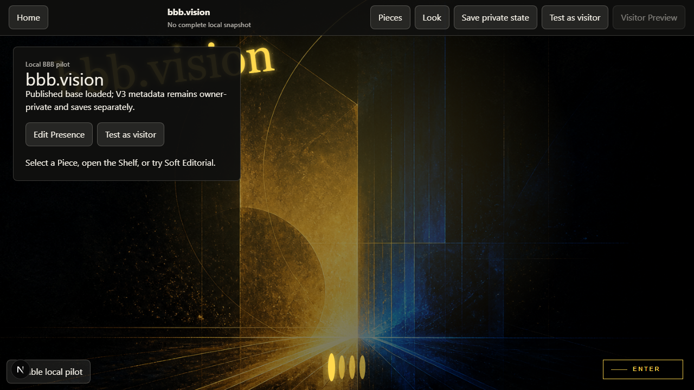

   

   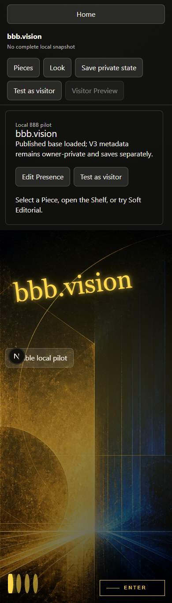

   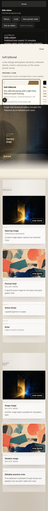

   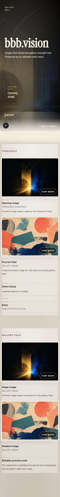

   

   

2. **Three same-content Looks - Health: healthy.** The difference is materially more than a palette swap. Soft Editorial opens the content into a light, spacious, quiet-framed editorial browse. Nocturnal Gallery changes the global renderer posture to a focused black threshold, luminous depth, and a signal-led reveal. Zine Archive uses a dense burgundy ledger field, mono/captioned treatment, square registered edges, compressed hierarchy, and archive-index journey. The catalog and compiler evidence also give each Look a distinct motion posture (`still`, `gentle`, `living`) and distinct atmosphere, density, treatment, and journey facets. The same two visual works and supporting copy remain recognizable throughout.

   

   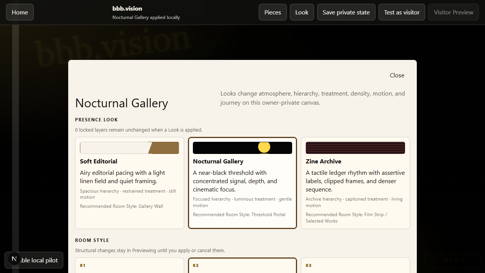

   

3. **Three Room Styles - Health: healthy.** Threshold Portal and Gallery Wall produce visibly different active-Room grouping: the portal creates a split arrival with a dominant threshold route, while the wall gives the opening work a broad exhibition lead followed by supporting material. Film Strip is the strongest structural departure: one active work, explicit progress, previous/next controls, a direct index, contextual notes, and a protected exit. In `06`, only Threshold becomes Film Strip while Gallery Field keeps its existing wall layout, which is direct visual proof that the style is chamber-local rather than a global renderer replacement.

   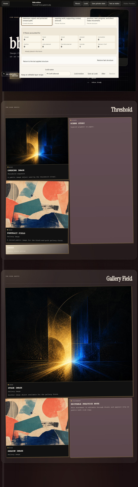

   

   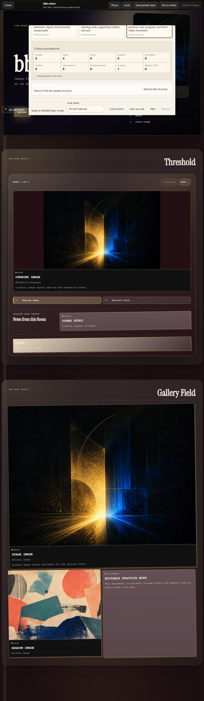

4. **Before, After, and Cancel - Health: healthy.** The preview panel names the target structure, labels the current side twice (pressed toggle and `Showing Before/After`), and states that no local snapshot or server state changes until Apply. Competing mutators are visibly disabled. Before shows the accepted Film Strip; After shows the staged Gallery Wall; Cancel removes the preview panel and returns the exact Film Strip composition with a plain-language restoration status. Apply and Cancel are separate, unambiguous actions.

   

   

   

5. **Compatibility accounting - Health: healthy.** The summary accounts for all five Pieces and exposes changed, placed, moved, unplaced, incompatible, overflow, lock, override, duplicate, and retained-in-Shelf states. The captured state is internally legible (`4` placed, `1` duplicate, all other exception counts `0`) and does not rely on colour alone. The underlying deterministic accounting tests cover the non-zero exception branches that this particular content set does not display.

   

6. **Mobile owner canvas and Film Strip - Health: healthy with follow-ups.** At `390 x 844`, the Look sheet becomes a horizontally scrollable card rail, the canvas remains visible, and the active Zine card is readable. Film Strip reflows to a single column with full-width previous/next controls, a contained stage, direct index, and a reachable onward CTA. Current test evidence checks 44px minimum control boxes, keyboard movement, touch movement, and an immediate Film Strip transition under reduced-motion preference.

   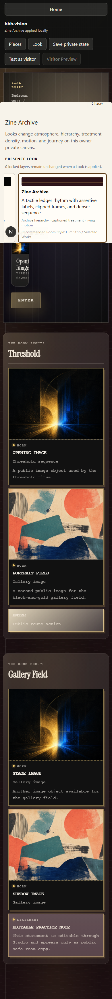

   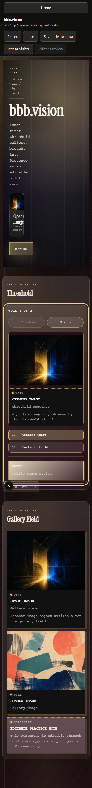

7. **Visitor-mode canvas - Health: healthy.** The owner top bar, action bar, sheet, and local-state flag are absent. The Film Strip and second chamber remain intact, while the single `Back to editor` escape is visible and does not compete with the artwork journey. This is a credible visitor view rather than an editor with hidden labels.

   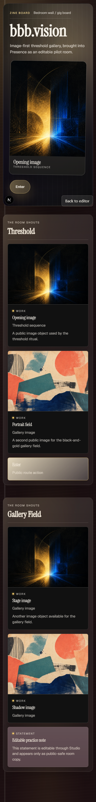

8. **Public route invariance - Health: healthy.** The pre-flow `/p/bbbvision` baseline and both post-flow public routes show the same threshold onboarding, navigation dock, copy, and visual hierarchy, with no Studio V3 owner chrome. The public-invariance spec additionally compares the public text signature and checks that private Studio fields are absent; this aesthetic review treats those assertions as supporting evidence, not as a pixel-equivalence claim.

   

   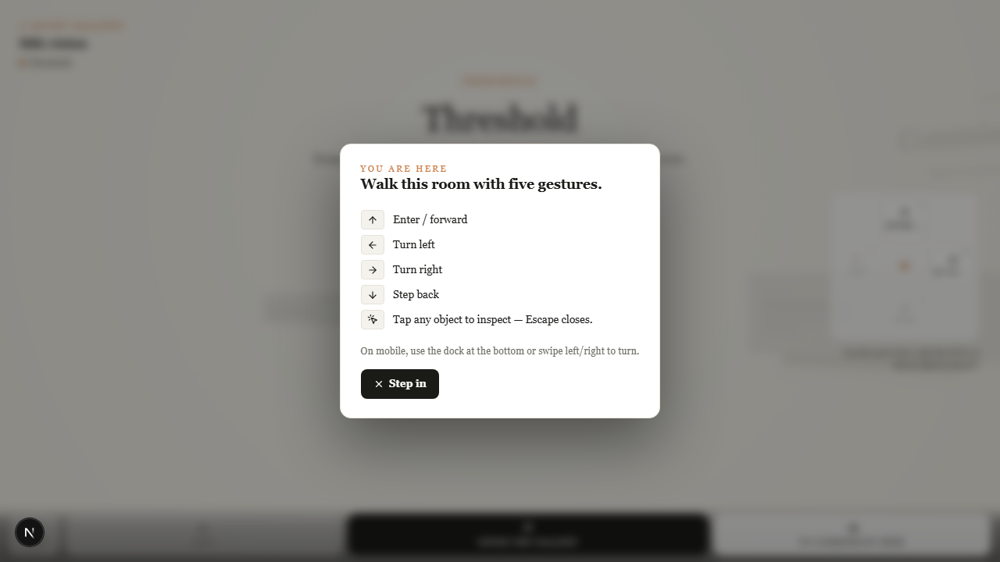

   

## Strengths

- Look identity is carried by hierarchy, spatial density, object treatment, typography, renderer posture, and journey - not colour alone.
- Room Style remains independent from Look: the Zine atmosphere survives all three structural previews, and Film Strip affects only the active chamber.
- The reversible structural workflow makes state, consequence, and exit clear before mutation.
- The compatibility summary makes preserved, rejected, duplicate, and shelved outcomes reviewable rather than silently dropping Pieces.
- Mobile and visitor captures preserve the artwork as the primary surface; controls reflow around it without visible collision.
- The fresh baseline and public captures retain the established BBB route experience.

## Blockers and follow-ups

**Blockers: none found in the inspected P1 evidence.** No required combination is visually broken, no required control is visibly unreachable, and no owner chrome leaks into visitor/public evidence.

Non-blocking follow-ups:

1. The mobile Zine threshold intentionally uses a narrow editorial rail, but its introductory sentence wraps into a very tall one-to-three-word column in `11`-`13`. Widen that copy measure or shorten the mobile introduction before broader release.
2. The Zine mono captions, eyebrow labels, helper copy, and disabled Film Strip state are deliberately compact/muted. Measure text and non-text contrast at runtime and test text resizing; screenshots alone cannot establish whether every small token remains comfortable.
3. Threshold Portal and Gallery Wall are structurally distinct in the active Room, but their second-chamber treatment is comparatively similar. A later polish pass could strengthen the portal's entry/signal hierarchy without changing the registered composition contract.
4. Keep a manual focus-order and focus-visibility pass in the next gate, including the horizontally scrolling mobile Look cards and the sheet close/preview actions.

## Accessibility evidence and limits

Visible and code/test-supported strengths include semantic fieldset groupings, pressed states for Look/Room and Before/After choices, polite live status/progress regions, a focusable Film Strip with labelled previous/next controls, 44px target assertions for core mobile controls, keyboard/touch Film Strip traversal, and reduced-motion CSS/runtime assertions. These are useful indicators, not a WCAG conformance result.

This audit does **not** claim WCAG compliance. Static screenshots cannot verify focus order, screen-reader announcements, accessible-name computation across browsers, animation quality, touch precision, or contrast ratios. The evidence covers one desktop viewport and one `390 x 844` mobile viewport with the sanitized BBB fixture; it does not cover 200%/400% zoom, tablet widths, high-contrast/forced-colour mode, localization, long real-world titles, or a browser/assistive-technology matrix. Motion differentiation is supported by the distinct Look tokens and reduced-motion implementation, but its qualitative feel cannot be judged from still frames. The public frames are visually consistent, not a formal pixel-diff certification.

## Verdict

The P1 experience is coherent, materially differentiated, reversible, and usable at the inspected desktop and mobile sizes. The visible follow-ups are polish and verification work, not blockers to this foundation gate.

**AESTHETIC VERDICT: PASS**
