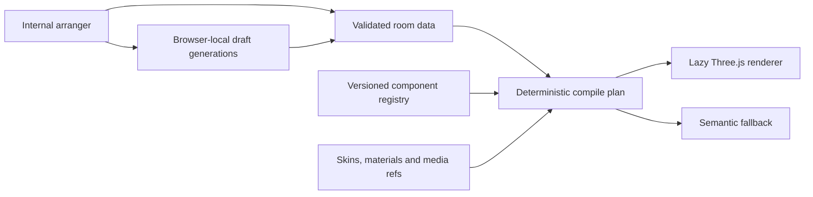

# ADR: Presence spatial object-model foundation

Date: 2026-08-17
Status: Accepted for the bounded internal Gate 3 foundation
Decision scope: V3.4 Gate 3 - V3.2 design-system architecture
Public status: Not registered, not published, and not launch-approved

## Context

Presence needs a reusable way to describe branded rooms without turning every candidate into a bespoke Three.js application. The standalone Mobstar prototype remains valuable art-direction and interaction evidence, and the existing BBB canvas gallery remains protected public behaviour. Neither is an appropriate persistence or component contract for a spatial publishing platform.

The 2026-08-16 World Manifest / Scene Ledger RFC prohibited runtime work under that work order. The product owner's approved 2026-08-17 spatial-object-model work order supersedes that prohibition only for this default-off internal Gate 3 slice. It does not approve Mobstar creatively, admit a production primitive, modify Gate 4, or authorise public registration, backend persistence, publishing, deployment, commerce, or self-service claims.

The protected public dispatch chain remains unchanged:

```text
app/(public)/p/[slug]/page.tsx
  -> lib/presence/render/publicPayload.ts
  -> components/portfolio/PortfolioRenderer.tsx
```

## Decision

Build an isolated, data-first spatial runtime with five boundaries:



### 1. Keep strategic and runtime contracts separate

`PresenceSpatialAggregate` records the strategic hierarchy: Presence, Space, Room, Wall, Surface, Object, Piece, Action, Material, CameraAnchor, and PlacementRule. It also reserves event-oriented room fields without implementing multiplayer.

`SpatialRoomDefinition` is the validated runtime document used by this proof. It contains lightweight component placements, assets, skins, media, actions, scene states, camera path, and semantic fallback rows. The compiler produces a renderer-neutral `SpatialRenderPlan`.

The aggregate contract is type-level in this slice. Strict runtime validation applies to `SpatialRoomDefinition`, registered components, and saved draft envelopes. Aggregate persistence or aggregate-to-runtime compilation is later work.

### 2. Reference components; do not duplicate geometry

Every placement references `componentId@version` plus transform, anchor, material-slot overrides, optional skin/media refs, and action refs. The registry owns dimensions, geometry strategy, anchors, material slots, placement rules, provenance, runtime size, performance tier, and mobile fallback.

The current registry contains admission-neutral procedural primitives. A process-global browser cache reuses geometry templates by `componentId@version`. This proves the cache key and ownership contract; it is not a hosted Asset API, CDN, or cross-device cache.

### 3. Prove a real Three.js path, with semantic parity

The internal route dynamically imports the Three.js renderer. The compiled plan drives room shell, floor, walls, table, plinth, rack, projection wall, Piece planes, materials, media, scene states, raycast activation, and inspection displacement. There are no renderer branches keyed to Mobstar or BBB names.

Mobile, reduced-motion, unavailable WebGL, and runtime context failure use a semantic renderer generated from the same plan. The fallback preserves essential Pieces and Actions. Mobile semantic fallback is intentional for this gate; reduced 3D remains a future lane.

### 4. Keep editing internal and persistence local

`/internal/spatial-object-model` is force-dynamic, noindex, disabled by default, and unconditionally unavailable in production. It supports constrained add, move, rotate, assign, reorder, save, reload, revert, reset, import, export, and current/saved preview operations.

Drafts are strictly validated JSON envelopes stored in browser `localStorage`, with an active and previous generation. This is best-effort local operator persistence, not an API, collaboration system, client self-service editor, or publish workflow.

### 5. Separate geometry from client expression

Shared geometry is customised through material presets, skins, colours, decals, logos, and media references. Presence must not create a GLB for every client variation. The runtime contract exposes these slots:

`wall`, `floor`, `tabletop`, `rack-metal`, `fabric`, `paper`, `projection`, `poster-decal`, and `logo-accent`.

Raw downloaded GLTF/GLB files are source assets only. Runtime candidates must be normalised to primitives, shape-only GLB, or optimised slotted geometry. Textured geometry is reserved for justified hero objects. No GLB loader or admitted model asset is included in this slice.

## Payload and hosting constraints

- Layout JSON hard limit: 100 KB.
- Eager compressed component and room assets: target and enforced limit of 3 MB.
- Internal total compressed asset ceiling: 12 MB; public candidates must be materially tighter.
- Fixture locators are opaque `generated:` or `public:` references; `.glb` and `.gltf` locators are rejected.
- Public routes must never inline model or media blobs.
- A raw 35 MB model must never ship in a Presence room.
- Client-specific skins and media remain separate, capped, and lazy where possible.

The current BBB proof is below the eager limit but has 5,956,155 bytes of total image media. It is acceptable as an internal lazy-load proof, not as a public payload target. Media optimisation is required before public consideration.

## Consequences

### Positive

- Mobstar is expressed as data instead of a candidate-specific renderer.
- BBB gallery behaviour becomes media assigned to the reusable projection-wall primitive.
- Renderer, arranger, and fallback consume one compiled plan.
- Invalid edits preserve the last valid room.
- Component geometry and client expression have separate lifecycles.
- Public dispatch, auth, tenant, backend, and publish paths remain untouched.

### Costs and limitations

- The strategic aggregate has no runtime validator or persistence adapter yet.
- Collision uses world-axis AABBs around rotated boxes. Bounds are tight per object, but collision between rotated objects is conservative.
- `localStorage` rollback is best effort because the browser provides no transaction.
- The renderer has no production GLB loader, mesh compression, texture pipeline, or CDN Asset API.
- Mobile uses semantic fallback rather than reduced 3D.
- Procedural fixtures establish architecture only; they do not pass visual-quality or primitive-admission review.

## Visual-quality admission rule

Procedural placeholders may prove schema and renderer behaviour, but they cannot become launch-facing components by default. Any real Presence library candidate requires separate art-direction review for silhouette, scale, material response, lighting compatibility, mobile readability, brand fit, provenance, licence, and attribution. Passing this ADR does not satisfy the Gate 4 creative bar.

## Rejected alternatives

- Continue the bespoke Mobstar scene: rejected because candidate-specific data, camera, materials, and behaviours would become platform dependencies.
- Deliver only a DOM/CSS spatial mock: rejected because the approved proof requires a Three.js-compatible component-reference model.
- Store complete model payloads in layouts: rejected for duplication, payload, security, and hosting-cost reasons.
- Refactor the public BBB canvas renderer now: rejected because it would expand blast radius and weaken public-route invariance.
- Add backend draft/publish persistence now: rejected because it is outside this Gate 3 work order.

## Rollback

Remove the internal route, `components/presence-spatial`, `lib/presence/spatial`, focused tests and evidence, then remove `three` and `@types/three` from the package files. No public dispatcher, backend schema, production data, auth, tenant, or publish rollback is required.
