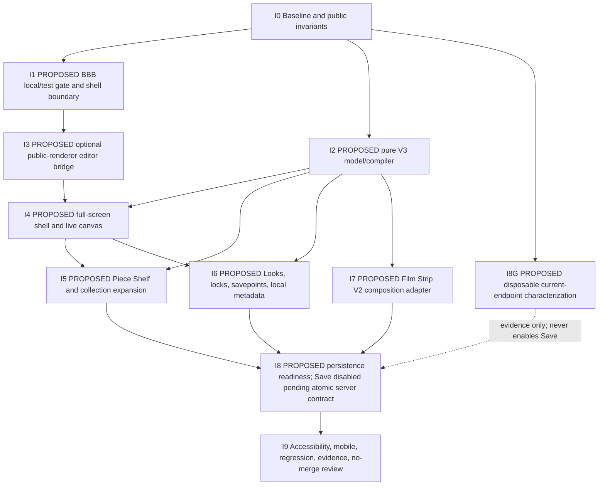

# Presence Studio V3 Implementation Plan

Status: plan only. This pass creates documentation and does not implement Studio V3.

## How to read this document

- **CURRENT FACT** identifies existing repository code or behaviour.
- **PROPOSED** identifies future implementation work.
- Every proposed implementation identifier is prefixed with **`[PROPOSED]`**.

## Outcome

Deliver a BBB-only, default-off local/test prototype of a full-screen Studio V3 client shell inside the current `/studio/[id]/editor` route. The prototype uses the existing V2 state, owner reads, public projection, and exact public-room renderer. It proves the product interaction model without changing backend, auth, control-plane, publishing, production data, or visitor routes. P0/P1 are zero-write; under this no-backend plan M1 Save Draft also remains disabled.

Execution is a dependency-ordered series of bounded child packets, each with one branch/PR and its own review. A temporary integration/review branch may assemble only already-reviewed packets to run the P0/P1 gates; it is not an omnibus implementation PR. Production activation and publishing are separate, explicitly unauthorised decisions.

## Locked boundaries

| Boundary | Required implementation behaviour |
| --- | --- |
| Editor entry | Add a `[PROPOSED]` default-off, local/test-only BBB gate in `presence-app/app/(studio)/studio/[id]/editor/page.tsx`. Branch to V3 before current `StudioShell`. |
| Existing owners | When the V3 gate is off or the room is not BBB, current V2/legacy routing is unchanged. |
| Renderer | The live canvas uses current `PresenceStudioV2PublicRoom`, not `PresenceStudioV2Room` and not a new renderer. |
| Renderer bridge | Add only the exact synchronous `[PROPOSED] PresenceStudioV2EditorBridge` intent/result contract frozen in `STUDIO_V3_VIEW_MODEL_AND_COMPILER.md`. It is optional and default `undefined`; undefined means public behaviour and output are expected byte-for-byte unchanged. |
| Compilation | V3 client intent compiles into current `StudioV2State`; current V2 adapters remain the draft/public engine. |
| Content | Current `PresenceWork`/`PresenceCollection` and owner APIs remain canonical. V2 objects are compiled visitor snapshots with opaque deterministic source-derived identifiers; raw source references remain editor-local and do not enter public projection. |
| V3 metadata | Browser-local and split into owner-partitioned Presence and Room envelopes scoped by immutable config identity plus canonical full-base fingerprint. Never written into current `editable_config` or `locked_fields`. Never contains URLs, private media references, or media blobs. |
| Persistence | Fail-closed and disabled. Current `PATCH` cannot delete stale nested owned keys; current client-refetch + `POST` is non-atomic and can create a draft. Both are forbidden in V3 runtime. Disposable local/test single-writer fixtures characterize them only. Save requires a separately approved server-side atomic expected-existing-draft identity/revision/stable-fingerprint precondition in the same transaction as all-nine-field replacement and media effects. No backend change is authorised here, so M1 Save stays disabled. |
| Publishing | No publish, rollback, unpublish, or public-node mutation call exists in the prototype. |
| Placement | Use current safe pixel transforms. Normalised/responsive placement is deferred to pre-market/V3.1. |
| Backend and security | No backend, auth, tenant, control-plane, serializer, or production-data changes. |

## Existing code to preserve

The implementation starts by protecting these current seams:

- `presence-app/app/(studio)/studio/[id]/editor/page.tsx`: current editor routing and owner boundary.
- `presence-app/components/studio/useOwnerNode.ts`: current owner/session loading.
- `presence-app/components/studio/StudioShell.tsx`: retained for current V2 and legacy owners; bypassed only in the gated V3 branch.
- `presence-app/lib/presence/studio-v2/feature.ts`: current V2 editor/public eligibility remains independent.
- `presence-app/lib/presence/studio-v2/model.ts`: current compilation target.
- `presence-app/lib/presence/studio-v2/layouts.ts`: current `gallery-wall` and `portal-threshold` layouts.
- `presence-app/lib/presence/studio-v2/adapters.ts`: `studioV2FromPresenceConfig`, `presenceConfigFromStudioV2State`, and `publicRoomFromStudioV2State`.
- `presence-app/lib/presence/studio-v2/sanitize.ts`: current public state stripping.
- `presence-app/components/presence-studio-v2/PresenceStudioV2PublicRoom.tsx`: exact visitor renderer.
- `presence-app/components/presence-studio-v2/BbbVisionCanvasGallery.tsx`: BBB-specific canvas branch.
- `presence-app/lib/api/editor.ts`: current overview and draft APIs.
- `presence-app/lib/api/owner.ts`: current Work/Collection APIs.
- `presence-app/lib/presence/render/publicPayload.ts`: current visitor payload boundary.
- `presence-app/app/(public)/p/[slug]/page.tsx` and `presence-app/app/(public)/presence/[slug]/page.tsx`: unchanged visitor routes.

## Dependency sequence

I1 and I2 can start after I0. I5, I6, and I7 can run in parallel only after the compiler contract and canvas seam are stable. Product Gate P0 integrates the reviewed I1–I5 outputs plus only the one-Look/lock/named-restore subset of I6; product Gate P1 adds the remaining three-Look/savepoint work in I6 plus I7. I8 begins only in Milestone 1 after P0/P1; it is never a prototype-gate dependency. I9 is mandatory before any broader pilot discussion.

## Work packages

### I0 — Baseline and safety harness

Purpose: establish evidence before changing shared renderer code.

CURRENT files and tests:

- `presence-app/tests/e2e/presence-studio-v2-bbbvision-pilot.spec.ts`
- `presence-app/tests/e2e/presence-studio-v2-bbbvision-generalisation.spec.ts`
- `presence-app/tests/e2e/presence-studio-v2-bbbvision-draft-write.spec.ts`
- `presence-app/tests/e2e/presence-studio-v2-bbbvision-publish-readiness.spec.ts`
- `presence-app/tests/e2e/presence-studio-v2-layout-composition.spec.ts`
- `presence-app/tests/e2e/presence-studio-v2-public-render.spec.ts`
- `presence-app/tests/e2e/presence-public-payload-hygiene.spec.ts`
- `presence-app/tests/e2e/presence-studio-owner-experience.spec.ts`

Tasks:

1. Record stable local fixture output for public BBB on canonical and legacy-compatible routes.
2. Record owner editor routing with all new flags absent.
3. Record the current public payload/DOM contract for a deterministic fixture.
4. Add a network assertion plan that fails on draft publish, node publish, rollback, unpublish, or public update calls.

Exit gate:

- Baseline evidence exists before shared-renderer edits.
- The public fixture is deterministic enough to support byte-for-byte output expectations when the bridge is undefined.
- No hosted data is touched.

Rollback: none; baseline tests/evidence only.

### I1 — BBB-only local/test route gate and full-screen branch

Likely current file:

- `presence-app/app/(studio)/studio/[id]/editor/page.tsx`

Likely new files:

- `[PROPOSED] presence-app/lib/presence/studio-v3/feature.ts`
- `[PROPOSED] presence-app/lib/presence/studio-v3/compiler.test.ts` (canonical shared pure-contract test file; gate cases only in this phase)
- `[PROPOSED] presence-app/components/presence-studio-v3/PresenceStudioV3Editor.tsx`

Proposed symbols:

- `[PROPOSED] shouldUsePresenceStudioV3Editor`
- `[PROPOSED] NEXT_PUBLIC_PRESENCE_STUDIO_V3_BBB_PILOT`
- `[PROPOSED] PresenceStudioV3Editor`

Rules:

1. The gate returns true only when `NODE_ENV` is not production, the explicit pilot flag is enabled, and the owned node matches BBB room `29` or slug `bbbvision`.
2. Production returns false even if the flag is accidentally present.
3. The V3 branch reuses current `useOwnerNode` and renders before current `StudioShell`.
4. Flag off, non-BBB, loading, unauthorised, V2, and legacy paths retain current behaviour.
5. The new gate does not modify `shouldUsePresenceStudioV2` or `shouldUsePresenceStudioV2Editor`.

Acceptance:

- BBB with explicit local/test flag enters V3 at the same editor URL.
- BBB without the flag and every non-BBB room remain on current paths.
- No Studio V3 bundle or metadata appears on visitor routes.

Rollback: remove the V3 branch and proposed gate file; current route flow remains intact.

### I2 — Pure V3 view model and compiler

Likely new files:

- `[PROPOSED] presence-app/lib/presence/studio-v3/model.ts`
- `[PROPOSED] presence-app/lib/presence/studio-v3/compiler.ts`
- `[PROPOSED] presence-app/lib/presence/studio-v3/sourceRefs.ts`
- `[PROPOSED] presence-app/lib/presence/studio-v3/compiler.test.ts`

Proposed symbols:

- `[PROPOSED] StudioV3Document`
- `[PROPOSED] StudioV3Presence`
- `[PROPOSED] StudioV3Room`
- `[PROPOSED] StudioV3Piece`
- `[PROPOSED] StudioV3Collection`
- `[PROPOSED] StudioV3Look`
- `[PROPOSED] StudioV3SourceRef`
- `[PROPOSED] hydrateStudioV3Document`
- `[PROPOSED] compileStudioV3ToStudioV2`
- `[PROPOSED] mergeStudioV3CompiledDraft`
- `[PROPOSED] makeStudioV3ObjectId`
- `[PROPOSED] StudioV3BaseIdentity`
- `[PROPOSED] StudioV3BaseFingerprint`
- `[PROPOSED] StudioV3ComparableConfig` (ten-field logical diff shape)
- `[PROPOSED] StudioV3PostPayload` (current nine-field transport shape)
- `[PROPOSED] projectStudioV3WireJson`
- `[PROPOSED] projectStudioV3StoredSemanticConfig`
- `[PROPOSED] canonicalizeStudioV3BaseConfig`
- `[PROPOSED] fingerprintStudioV3BaseConfig`
- `[PROPOSED] diffStudioV3OwnedConfig`
- `[PROPOSED] studioV3PostPayloadFromComparable`

Rules:

1. Functions are pure except the separate draft API caller.
2. One V3 Room maps to one current V2 chamber.
3. Source references use `work:<id>`, `collection:<id>`, or `legacy-object:<id>`.
4. Compiled object identifiers are opaque and deterministic by Room and terminal Piece. Raw source references are not emitted into public V2 object fields/identifiers.
5. Collection placement expands to Pieces, preserves canonical order, dedupes within a Room, and returns incompatible items to a visible shelf result.
6. Current V2 objects are visitor snapshots, never the canonical content record.
7. Current pixel transforms are preserved/used; no normalised coordinate abstraction is introduced.
8. The exact full overview config, immutable identity, and SHA-256 fingerprint of the frozen stable stored-semantic projection are compiler inputs; version/`updated_at` alone are insufficient. Owner GET, fresh comparison, and refetch use the same projection.
9. The compiler-owned-path policy is the normative table in `STUDIO_V3_VIEW_MODEL_AND_COMPILER.md`; all other paths are preserved exactly.
10. Candidate comparison and required-field presence use `[PROPOSED] projectStudioV3WireJson`, exactly equivalent to `JSON.parse(JSON.stringify(candidateInput))` after unsafe non-JSON validation. Nested plain-object `undefined` is omitted as on the wire; an absent/`undefined` required top-level field blocks.
11. Stable stored semantics recursively omit only `url` and `preview_expires_at` from qualifying non-empty-`media_id` + `visibility === "private_draft"` objects under `scene_config`, `asset_config`, and `content_config`; all other fields and ordinary/public URLs are preserved.

Acceptance:

- Repeat compilation is idempotent for the same inputs.
- Input objects remain unchanged.
- Source resolution and identifiers are deterministic.
- Collection expansion never silently loses an item.
- Unrelated config keys/sections survive draft merge.
- Same-version/different-stored-content fails the base comparison; regenerated qualifying private URL/expiry alone does not.
- Removed keys inside owned `studio_v2` subtrees are absent from the complete candidate; unowned sibling canaries are unchanged.
- Wire-projected comparison retains all ten fields; the wire-projected payload intentionally omits only `schema_version` and retains all nine transport fields. Nested object `undefined` is omitted; top-level required `undefined` blocks.
- Projection fixtures prove regenerated private URL/expiry equality; changed `media_id`, visibility, another stored field, or an ordinary/public URL inequality.
- Public projection contains no V3 metadata.
- Public projection contains no raw Work/Collection source references.

Rollback: delete the isolated proposed V3 library; no current runtime path depends on it until I1/I4 integration.

### I3 — Optional editor bridge on the exact public renderer

Likely current files:

- `presence-app/components/presence-studio-v2/PresenceStudioV2PublicRoom.tsx`
- `presence-app/components/presence-studio-v2/BbbVisionCanvasGallery.tsx`

Proposed symbol:

- `[PROPOSED] PresenceStudioV2EditorBridge`

Scope:

1. Implement verbatim the synchronous `PresenceStudioV2EditorIntent` / `PresenceStudioV2EditorResult` / `PresenceStudioV2EditorBridge.handleIntent` TypeScript contract in `STUDIO_V3_VIEW_MODEL_AND_COMPILER.md`; add the optional prop with default `undefined`.
2. Stable-ID Piece pointer/touch/Enter/Space emits `activate-piece`; no-ID CTA/link emits suppress-only; direct/Arrow Room navigation emits the computed destination Room and selects it in editor state without visitor navigation; Escape clears selection; unsupported chrome is suppress-only.
3. Branch inside every native BBB callback before `onSelectWork`, `onFocusWork`, focus/lightbox, `setView`, `markMovement`, `window.history`, hash, or direct-navigation effects. Handling an intent cancels pending focus transition. The animation completion callback rechecks the current bridge before `onFocusWork`; window key handling rechecks before Arrow/Escape effects.
4. Reflect selected identity only through existing visual semantics or editor-only overlay owned by V3; do not inject editor UI into the public renderer.
5. Keep the floating action bar, sheet, local metadata, and editor imports outside V2.

Acceptance:

- With the bridge supplied, pointer/touch/Enter/Space identify the same stable Piece; no-ID actions and unsupported chrome are inert; direct/Arrow Room intent selects/emits the destination without view/hash/history mutation; Escape clears selection.
- BBB `BbbVisionCanvasGallery` cancels pending focus and never calls `onFocusWork` after an animation-time bridge recheck.
- With the bridge undefined, stable public fixture markup, data, events, and visuals meet the byte-for-byte unchanged expectation.
- Public payload hygiene remains green and contains no V3 names/metadata.

Rollback: remove the optional prop/callback wiring. V2 rendering remains the prior implementation.

### I4 — Full-screen live editor shell and contextual controls

Likely new files:

- `[PROPOSED] presence-app/components/presence-studio-v3/PresenceStudioV3Editor.tsx`
- `[PROPOSED] presence-app/components/presence-studio-v3/PresenceStudioV3Canvas.tsx`
- `[PROPOSED] presence-app/components/presence-studio-v3/StudioV3ActionBar.tsx`
- `[PROPOSED] presence-app/components/presence-studio-v3/StudioV3BottomSheet.tsx`
- `[PROPOSED] presence-app/components/presence-studio-v3/presence-studio-v3.css`

Proposed symbols:

- `[PROPOSED] PresenceStudioV3Canvas`
- `[PROPOSED] StudioV3ActionBar`
- `[PROPOSED] StudioV3BottomSheet`

Scope:

1. Use `publicRoomFromStudioV2State` and current `PresenceStudioV2PublicRoom` for every live canvas render.
2. Open into the Presence, not a dashboard or inspector cockpit.
3. Tap/select a Piece to show a compact floating action bar.
4. Expand deeper controls into a touch-first bottom sheet.
5. Provide safe move/reorder, feature/unfeature, scale, and depth controls using current V2 transform bounds.
6. Keep direct manipulation optional and constrained; no arbitrary breakable freeform positioning.
7. Provide a visible Piece Shelf entry point, Look switcher, visitor-preview link, draft state, and disabled/non-publishing “Review & Publish” explanation.

Acceptance:

- A new owner can identify the canvas, Shelf, Look control, and safe preview path quickly.
- Controls never obscure the selected Piece without a way to dismiss/reposition.
- Touch targets, keyboard focus, escape/dismiss behaviour, and reduced-motion behaviour are defined.
- Desktop expands the same interaction model; tablet is the ideal canvas; mobile remains fully operable.

Rollback: disable the V3 gate; the current V2 editor remains available.

### I5 — Piece Shelf and Collection placement

Likely current sources:

- `presence-app/lib/api/owner.ts`
- `presence-app/lib/api/types.ts`
- owner `PresenceNode.works` and `PresenceNode.collections` data where already present.

Likely new files:

- `[PROPOSED] presence-app/components/presence-studio-v3/StudioV3PieceShelf.tsx`
- `[PROPOSED] presence-app/lib/presence/studio-v3/contentAdapter.ts`

Proposed symbols:

- `[PROPOSED] StudioV3PieceShelf`
- `[PROPOSED] adaptPresenceWorkToStudioV3Piece`
- `[PROPOSED] expandStudioV3CollectionPlacement`

Scope:

1. Read canonical Works and Collections; do not duplicate content management.
2. Place one Piece or one Collection into the current Room.
3. Expand Collections into ordered terminal Pieces.
4. Dedupe same-Room placements.
5. Show placed, unplaced, incompatible, and unresolved states visibly.
6. Removing a room placement returns the Piece to the Shelf; it never deletes the Work.
7. Permanent Work edit/delete and Collection CRUD remain existing Library operations during the prototype.

Acceptance:

- Placing a Piece changes the live canvas immediately.
- Placing a Collection produces deterministic Piece order.
- Incompatible Pieces remain visible with reasons and an outcome summary.
- Reload with matching owner/scope/base-identity/fingerprint browser-local provenance can recover terminal Piece identities. Without that local provenance, unmatched compiled objects hydrate conservatively as `legacy-object:<id>` rather than using title/URL guesses.

Rollback: remove the Shelf UI and V3 content adapter; canonical Works/Collections are untouched.

### I6 — Looks, locks, savepoints, and browser-local metadata

Likely new files:

- `[PROPOSED] presence-app/lib/presence/studio-v3/looks.ts`
- `[PROPOSED] presence-app/lib/presence/studio-v3/localMetadata.ts`
- `[PROPOSED] presence-app/lib/presence/studio-v3/compiler.test.ts` (canonical shared pure-contract test file; local-envelope cases in this phase)
- `[PROPOSED] presence-app/components/presence-studio-v3/StudioV3LookControls.tsx`

Proposed symbols:

- `[PROPOSED] STUDIO_V3_BUILT_IN_LOOKS`
- `[PROPOSED] applyStudioV3Look`
- `[PROPOSED] StudioV3LayerLockMap`
- `[PROPOSED] StudioV3OwnerPartitionKey`
- `[PROPOSED] StudioV3PresenceLocalEnvelope`
- `[PROPOSED] StudioV3RoomLocalEnvelope`
- `[PROPOSED] StudioV3ModePreference`
- `[PROPOSED] StudioV3LookMediaRef`
- `[PROPOSED] deriveStudioV3OwnerPartitionKey`
- `[PROPOSED] loadStudioV3LocalMetadata`

Scope:

1. Define Soft Editorial, Nocturnal Gallery, and Zine Archive as substantially different multi-layer presets.
2. Apply a Look instantly to the in-memory canvas while preserving locked layers.
3. Save and restore owner-named normalised editable layer values/recommendations and provenance. Named Looks never contain locks or placement/order; destination locks remain independent and in force during apply/restore.
4. Create a structurally complete savepoint before a transformation, including separately applying a named Look's structural recommendations, and support staged before/after comparison. Ordinary named Look layer restore uses a reversible staged layer baseline, not a structural savepoint. Savepoints include references for Room order/entry, styles/compositions, Collection Presentations, Piece placement/order/feature/depth, visibility, required CTA, navigation, resolved layer values/overrides, locks, and Look/revision provenance.
5. Derive an opaque owner partition from deployment scope plus the SDK-validated authenticated owner subject; never persist raw user identity or parse an unverified token. If unavailable, use in-memory state only.
6. Split state into a Presence envelope and per-Room envelopes. Both require exact owner, scope, immutable base identity, and canonical full-base fingerprint. Presence holds Named Looks, global locks/navigation/savepoints, and validated mode; Room holds only that Room's locks/overrides/placement/shelf provenance.
7. Validate mode as `simple` or `advanced-creative`, defaulting invalid/missing values to `simple`; operator/debug is never storable.
8. Named Looks may contain media only as opaque stable asset IDs found in the current owner-authorised asset inventory. If no such ID exists, exclude media from the Look. Never store URLs, signed/private references, blobs, base64, or copied asset records.
9. On logout/account switch, clear memory and remove all Presence/Room/quarantine entries in the previous opaque owner partition before loading another. On cleanup uncertainty, disable local persistence. Room switches never apply another Room's envelope.
10. Quarantine/discard on any owner/scope/identity/fingerprint/schema mismatch, including same-version/different-content; never auto-merge.

Acceptance:

- All three Looks visibly change atmosphere, layout/presentation, treatment, density, and motion.
- A locked layer remains unchanged across at least two Look switches.
- A named Look restores the same effective visual state for unchanged canonical content.
- A named Look cannot alter placement/order unless a separate structural transformation/savepoint operation is explicitly applied.
- A savepoint can restore its included structural/style references exactly or returns an unresolved-reference report; it never substitutes media silently.
- Presence mode round-trips only as `simple` or `advanced-creative`; invalid/operator values fail closed to `simple`.
- Named Look media stores only an owner-authorised opaque stable asset ID; unavailable IDs leave destination media unchanged and produce a summary.
- Same-version/different-content, cross-owner, cross-Presence, and cross-Room envelopes cannot apply stale local state.
- Logout/account switch clears the prior owner partition and in-memory state; failure disables local persistence.
- Current `editable_config` and `locked_fields` contain no V3 metadata.

Rollback: clear only the affected opaque owner partition, clear V3 memory, and remove the isolated V3 controls. No server cleanup is required.

### I7 — Film Strip / Selected Works composition adapter

Likely current files:

- `presence-app/lib/presence/studio-v2/layouts.ts`
- `presence-app/components/presence-studio-v2/PresenceStudioV2PublicRoom.tsx`
- `presence-app/components/presence-studio-v2/presence-studio-v2-public.css`

Proposed symbol:

- `[PROPOSED] film-strip-selected-works`

Scope:

1. Add one explicit third V2 composition layout alongside current `gallery-wall` and `portal-threshold`.
2. Render it inside current `PresenceStudioV2PublicRoom`; do not create a renderer family.
3. Use existing public objects, sanitization, visibility, and reduced-motion rules.
4. Provide deterministic order and current safe pixel-transform fallbacks.
5. Keep its public behaviour general enough for non-BBB content later, but activate it only through the local/test V3 prototype.

Acceptance:

- The layout is visually and structurally distinct from Threshold Portal and Gallery Wall.
- Keyboard, touch, mobile, reduced-motion, and public-payload hygiene tests pass.
- Existing two composition layouts are unchanged for unchanged inputs.

Rollback: remove the proposed layout union branch and CSS; compiled prototype state falls back to Gallery Wall with an explicit warning.

### I8 — Persistence readiness and atomic-save prerequisite

Likely current file/API:

- `presence-app/lib/api/editor.ts`
- `getPresenceEditor`
- `createPresenceEditorDraft` (current create-or-update POST helper; characterization only, never a V3 runtime save)
- `patchPresenceEditorDraft` (current recursive-merge helper; inspect and test as a negative capability only, never call from V3 product code)
- `presence-app/lib/presence/studio-v2/adapters.ts`

Likely new integration file:

- `[PROPOSED] presence-app/lib/presence/studio-v3/draft.ts`

Proposed symbols:

- `[PROPOSED] saveStudioV3CompiledDraft`
- `[PROPOSED] StudioV3BaseIdentity`
- `[PROPOSED] StudioV3BaseFingerprint`
- `[PROPOSED] StudioV3ComparableConfig`
- `[PROPOSED] StudioV3PostPayload`
- `[PROPOSED] canonicalizeStudioV3BaseConfig`
- `[PROPOSED] fingerprintStudioV3BaseConfig`
- `[PROPOSED] diffStudioV3OwnedConfig`
- `[PROPOSED] studioV3PostPayloadFromComparable`
- `[PROPOSED] projectStudioV3WireJson`
- `[PROPOSED] projectStudioV3StoredSemanticConfig`

Scope:

1. Record the CURRENT constraint: backend `PATCH` uses recursive `_deep_merge`; omission cannot delete stale nested owned keys. V3 never uses `patchPresenceEditorDraft`.
2. Keep Save Draft visibly disabled through P0/P1 and M1 under this no-backend plan. Do not call current POST/PATCH or a preview endpoint that may ensure/create a draft.
3. At load and advisory fresh/refetch reads, validate immutable identity and fingerprint the same stable stored-semantic ten-field projection. Under only `scene_config`/`asset_config`/`content_config`, recursively omit `url` and `preview_expires_at` only on objects with valid non-empty `media_id` and exact `visibility: "private_draft"`; preserve every other field and ordinary/public URL. `updated_at` is diagnostic only.
4. Project every candidate through exact wire JSON (`JSON.parse(JSON.stringify(candidateInput))`) after rejecting unsafe non-JSON values. Allowed-diff uses projected JSON. Nested object `undefined` is omitted; all ten comparable fields and, after omitting only `schema_version`, all nine payload fields must remain present.
5. Client refetch/identity/fingerprint equality is advisory only; it is non-atomic with current POST. Post-refetch is verification only and cannot repair that race.
6. The current endpoint fixture below is disposable local/test single-writer characterization. It never sets an enabling capability.
7. Runtime Save requires a separately approved server endpoint that, in one transaction, locks/selects the expected existing draft; compares identity, status, revision, schema, and stable fingerprint; conflicts on missing/mismatch before config/media mutation; replaces all nine fields; and rolls back config plus media/status effects together. It must never create a draft implicitly. No backend implementation is authorised here.
8. Never call publish, rollback, node-status, unpublish, or public-mutation APIs.

Disposable current-endpoint characterization fixture (never enables Save):

1. Use an isolated local/test draft, never hosted or production data.
2. Capture an all-nine-field wire-projected POST against an existing draft: owned `stale` deletion, all unowned canaries/collections and schema retained, and published/public invariance.
3. Capture a separate no-draft POST creating a draft as unsafe/disqualifying behavior.
4. Across all three media-bearing sections, capture known private-reference stripping (`url`, `image_url`, `thumbnail_url`, `preview_expires_at`) and owner-GET regeneration of `url`/expiry.
5. Snapshot media rows/statuses: selected private rows in `draft_uploaded`/`orphaned`/`ready` change exactly to `draft_attached`; every other selected status and unselected row is unchanged; no unexpected row is inserted/deleted/reassigned.
6. Capture negative PATCH stale retention and zero publish/rollback/public mutation. Clean up only disposable fixture data.

Acceptance:

- Same-version/different-content is rejected before compile-for-write or network mutation.
- Missing/invalid identity, unavailable fingerprinting, or unsafe comparison produces local-only/write-disabled UI.
- Allowed-diff tests derive exclusively from the normative owned-path table.
- PATCH negative fixture retains stale nested `objectState`, documenting why it is forbidden.
- Existing-draft POST characterization records owned deletion, unowned retention, private-media stripping/status effects, no unexpected media rows, no-draft creation risk, and public invariance; it never enables Save.
- Wire/stable-projection fixtures cover regenerated private URL/expiry equality; changed media ID/visibility/stored field and public URL inequality; nested undefined omission; and top-level required undefined blocking.
- Save remains disabled until a separately approved atomic server contract exists and passes independent backend/auth/security review.
- Public BBB remains equal during disposable endpoint characterization and, later, after any separately approved atomic draft save.
- Network logs contain no publish, rollback, unpublish, or public mutation.
- Failed saves retain working client state and provide a retry path.
- Confirmed discard returns to the last saved draft without a publish/rollback request.

Rollback: disable draft-write capability and/or the V3 gate. Existing drafts remain ordinary V2 drafts; no backend cleanup, deletion support, or public rollback is introduced.

### I9 — Accessibility, mobile, regression, evidence, and no-merge review

Canonical proposed test manifest; these names must not be forked by work packages:

| PROPOSED test | Owner |
| --- | --- |
| `[PROPOSED] presence-app/lib/presence/studio-v3/compiler.test.ts` | All pure gate/compiler/owned-path/local-envelope contracts plus exact wire/stable-semantic fixtures and synchronous bridge intent/result classification. |
| `[PROPOSED] presence-app/tests/e2e/presence-studio-v3-bbb-prototype.spec.ts` | Core BBB interaction/local-only flow; M1 evidence may characterize current POST/PATCH/no-draft/media effects but never enables Save. |
| `[PROPOSED] presence-app/tests/e2e/presence-studio-v3-public-invariance.spec.ts` | Public payload/renderer/no-instrumentation invariance. |
| `[PROPOSED] presence-app/tests/e2e/presence-studio-v3-mobile-accessibility.spec.ts` | Mobile, touch, keyboard, focus, contrast, reduced motion. |

Supported compiler/unit command for this Windows workspace:

`npx.cmd tsx --test lib\presence\studio-v3\compiler.test.ts`

The current package does not declare a `tsx` script. Use this already evidenced `npx.cmd tsx --test` form; if it would require an unapproved download or package-file mutation, stop rather than silently adding a dependency.

Canonical proposed E2E command:

`npm run test:e2e -- tests/e2e/presence-studio-v3-bbb-prototype.spec.ts tests/e2e/presence-studio-v3-public-invariance.spec.ts tests/e2e/presence-studio-v3-mobile-accessibility.spec.ts`

Required validation:

1. `npm run typecheck`
2. `npm run build`
3. Canonical proposed compiler/unit invocation above.
4. Canonical proposed V3 E2E invocation above.
5. Targeted current V2/public regression specs listed in I0.
6. Desktop, tablet, narrow mobile, keyboard-only, touch, reduced-motion, and contrast manual QA.
7. Network trace proving no publish route call.
8. Public BBB payload and stable rendered-output comparison before/after.
9. Security review of owner-partitioned local storage, source refs, Named Look asset IDs, public props, and unsupported media.
10. No-merge checklist with a second reviewer.

Exit gate:

- All prototype acceptance criteria pass.
- Evidence includes route matrix, public comparison, draft-only network trace, compiler test output, and visual interaction captures.
- Reviewer confirms no backend/auth/control-plane/public mutation.
- Prototype remains default-off and local/test-only.

Rollback: disable/remove the gate and clear the browser-local prototype namespace. Any test draft can be reverted through the separately approved existing draft workflow; no automatic rollback call is part of this prototype.

## Proposed file impact summary

No file in this table is changed by this documentation pass.

| Classification | File |
| --- | --- |
| CURRENT, likely narrow edit | `presence-app/app/(studio)/studio/[id]/editor/page.tsx` |
| CURRENT, likely narrow edit | `presence-app/components/presence-studio-v2/PresenceStudioV2PublicRoom.tsx` |
| CURRENT, likely narrow edit | `presence-app/components/presence-studio-v2/BbbVisionCanvasGallery.tsx` |
| CURRENT, likely narrow edit | `presence-app/lib/presence/studio-v2/layouts.ts` |
| CURRENT, likely narrow edit | `presence-app/components/presence-studio-v2/presence-studio-v2-public.css` |
| `[PROPOSED]` new area | `presence-app/components/presence-studio-v3/` |
| `[PROPOSED]` new area | `presence-app/lib/presence/studio-v3/` |
| `[PROPOSED]` new specs | `presence-app/tests/e2e/presence-studio-v3-*.spec.ts` |

Current public routes, `publicPayload.ts`, owner/auth code, backend files, and database models are read-only for the prototype.

## Integration rules for parallel implementation

To keep one coherent architecture:

1. I2 owns all V3↔V2 mapping and source-reference logic. UI tasks may not create alternate mapping code.
2. I3 owns the only permitted renderer seam. UI tasks may not fork or copy the public renderer.
3. I6 owns the opaque owner partition plus separate Presence/Room envelope schemas. Other tasks consume them only through the proposed API.
4. I5 owns canonical Work/Collection adaptation. No UI-local title/URL matching.
5. I8 owns the disabled persistence boundary. No component may call current POST/PATCH, preview, or publish APIs. Existing-endpoint characterization is isolated test code only.
6. I9 reviewer checks forbidden imports/calls and public output before integration.

## Risks and mitigations

| Risk | Severity | Mitigation and stop condition |
| --- | --- | --- |
| Shared public renderer changes public BBB output | Critical | Baseline first; optional bridge defaults undefined; stable fixture comparison. Stop if undefined output differs without an explained, separately approved fix. |
| Non-atomic/create-on-POST draft replacement | Critical | Current POST/PATCH never enable V3 Save. Characterize only in disposable single-writer local/test data. Require separately approved transactional expected-existing identity/revision/stable-fingerprint precondition before any runtime write. |
| Same version hides changed content | Critical | Compare immutable config identity plus SHA-256 of canonical full editable base after a fresh GET. `updated_at` is supplemental only. Any unsafe/unavailable comparison disables writes. |
| Private V3 metadata enters raw public serialization | Critical | Keep it browser-local; forbid `locked_fields` and arbitrary editable-config storage; scan public payload and source. |
| Raw Work/Collection references leak through public object IDs | High | Use opaque deterministic source-derived IDs; retain the ref mapping only in matching owner/scope/base-identity/fingerprint Room state; assert no source-ref grammar in public output. |
| Draft written to public/publish endpoint | Critical | Central draft service only; import/network tests forbid publish/rollback/unpublish/public update. |
| Stale local Look overwrites a newer server draft | High | Opaque owner partition plus separate Presence/Room envelopes keyed by immutable identity and full-base fingerprint; strict mismatch quarantine/discard; no automatic merge. |
| Local state crosses owner or Room | Critical | Clear prior owner partition on logout/account switch; exact owner/Presence/Room validation; cleanup uncertainty disables local storage; cross-owner/cross-Room negative tests. |
| Named Look leaks media URL/private reference | Critical | Only current owner-authorised opaque stable asset IDs; no URL/blob/private reference; omit Look media when an ID is unavailable. |
| Collection placement duplicates or loses Works | High | Deterministic terminal refs, dedupe summary, visible unresolved shelf state, pure compiler tests. |
| Film Strip becomes a new renderer project | Medium | One V2 composition adapter only; no renderer family, backend model, or generic layout system. |
| Current pixel placement fails responsively | Medium | Constrain to existing safe transforms and test mobile. Normalised coordinates remain an explicit V3.1 prerequisite. |
| Current Work schema cannot express a medium | Medium | Infer conservatively; keep unknown/incompatible items visibly shelved; do not mutate backend. |

## Rollout and rollback

### Prototype rollout

1. Local/test only.
2. Explicit flag absent by default.
3. BBB room/slug allowlist hard condition.
4. No production activation path.
5. No publish capability.
6. Draft-write capability remains off; current-endpoint characterization cannot enable it. A separately approved atomic server contract is required.

### Immediate rollback

1. Turn off/remove the local/test V3 flag.
2. BBB returns to the current V2 editor because the route branch is additive.
3. Clear only the affected opaque owner partition (Presence, Room, and quarantine envelopes) plus V3 in-memory state.
4. Leave server drafts untouched unless a human separately approves using the current draft revert workflow.
5. Shared renderer bridge remains inert when undefined; if it causes regression, revert that narrow optional change.

## Deferred pre-market/V3.1 plan

Start only after prototype evidence and a separate architecture/security approval:

- Private server persistence for V3 metadata with explicit public exclusion and optimistic concurrency.
- Generic Work media/date/type semantics.
- Ordered many-to-many Collections and batch reorder.
- First-class source-linked placements rather than compiled snapshots alone.
- Normalised/responsive placement.
- Durable cross-device named Looks and savepoints.
- Crop/focus and complete Piece Treatment model.
- Room transitions and entrance animation.
- Production pilot controls, observability, migration, and rollback.
- Atomic expected-existing-draft replacement with transactional config/media rollback, or any deletion/tombstone contract, only through a separately approved backend/security task.

## Definition of implementation-ready

The prototype may move from plan to code only when:

- Product, UX, content, customisation, risk, and acceptance documents agree with this compiler boundary.
- The exact three Looks and three Room Styles have approved visual intent.
- Public-invariance fixture strategy is accepted.
- Local metadata mismatch/quarantine behaviour is accepted.
- Opaque owner partitioning, split Presence/Room envelopes, logout/account-switch clearing, and validated mode behaviour are accepted.
- Named Look media is limited to owner-authorised opaque stable asset IDs and is omitted when unavailable.
- Immutable base identity, canonical full-config fingerprint, normative owned-path table, and same-version/different-content tests are accepted.
- Current POST/PATCH/no-draft/media behavior is characterized only in disposable local/test data, and V3 Save remains disabled pending a separately approved atomic server contract.
- The no-publish network policy is testable.
- A no-merge reviewer is assigned.
- The implementation prompt repeats the backend/auth/public prohibitions and the default-off local/test gate.
