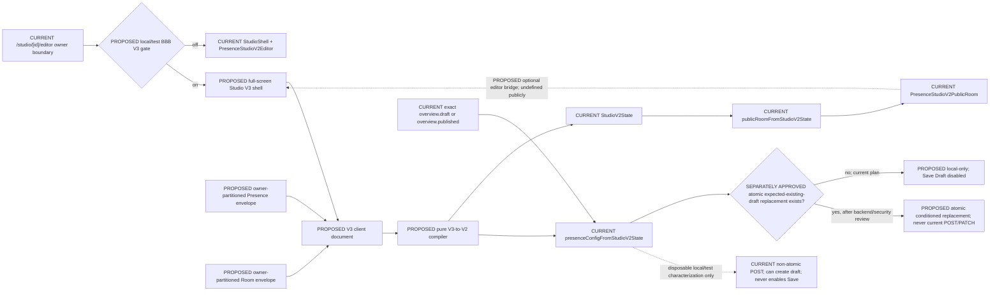

# Presence Studio V3 View Model and Compiler

Status: specification only; no implementation is authorised by this document.

## How to read this document

- **CURRENT FACT** describes code or behaviour that exists in the repository now.
- **PROPOSED** describes Studio V3 future work.
- Every proposed implementation identifier is prefixed with **`[PROPOSED]`**. Untagged identifiers in code font are current repository symbols.

## Decision

Studio V3 is a replacement owner-facing client shell inside the existing `/studio/[id]/editor` route. It is not a new renderer, backend, publishing path, or public payload.

The V3 client view model expresses owner intent as Presence, Rooms, Pieces, Collections, and Looks. A pure compiler translates the visitor-visible part of that intent into the existing Studio V2 state. The existing V2 adapter then merges the compiled state into the exact current draft or published editable config, and the existing V2 public-room component renders the live canvas.

V3-only creative metadata—layer locks, named Looks, transformation savepoints, staging state, and before/after state—remains browser-local for the prototype. Presence-level and Room-level envelopes are separated, partitioned by an opaque authenticated-owner key, and scoped to an immutable server-config identity plus a canonical full-base-config fingerprint. Version and `updated_at` alone are not concurrency controls. V3 metadata must not be written into the current `editable_config`, including `locked_fields`, because the current backend public serialization does not provide a safe private namespace for arbitrary editor metadata.

Draft persistence is fail-closed. The current `PATCH` endpoint recursively deep-merges nested dictionaries and therefore cannot reliably delete stale keys inside compiler-owned V2 subtrees. The current client refetch followed by the current `POST` is non-atomic, and that `POST` calls draft creation when no draft exists; therefore no local/client fixture can make it a safe Studio V3 save path. Runtime **Save Draft stays disabled** until a separately approved server implementation enforces an expected-existing-draft immutable identity, revision, and stable stored-semantic fingerprint in the same database transaction as complete replacement. Missing/mismatched preconditions must conflict before config or media mutation, and media side effects must roll back transactionally. Existing-endpoint fixtures are disposable local/test, single-writer characterization only; they never enable Save. No backend implementation is authorised here.

## Current architecture baseline

### Entry and ownership

| Current file or API | CURRENT FACT |
| --- | --- |
| `presence-app/app/(studio)/studio/[id]/editor/page.tsx` | The owner editor entry point calls `useOwnerNode`, evaluates `shouldUsePresenceStudioV2Editor`, and renders `PresenceStudioV2Editor` inside `StudioShell` when V2 is enabled. |
| `presence-app/components/studio/useOwnerNode.ts` | `useOwnerNode` resolves the owner session and loads the owned node with `getNode`. Its owner/auth boundary is reused unchanged. |
| `presence-app/components/studio/StudioShell.tsx` | The existing horizontal Studio cockpit shell. V3 must branch before this component so its full-screen surface is not nested inside the legacy information architecture. |
| `presence-app/lib/presence/studio-v2/feature.ts` | `shouldUsePresenceStudioV2Editor` is the current V2 editor gate. It contains BBB editor-only pilot identifiers `29` and `bbbvision`. This does not make BBB automatically eligible on the public route. |
| `presence-app/app/(studio)/studio/[id]/editor/preview/page.tsx` | The private preview route renders `PresenceDraftPreviewPage`. It is not the V3 live-canvas implementation. |

### V2 state, compilation, and projection

| Current file or API | CURRENT FACT |
| --- | --- |
| `presence-app/lib/presence/studio-v2/model.ts` | Defines `StudioV2State`, `StudioV2Chamber`, `StudioV2Object`, `StudioV2PublicRoom`, and `StudioV2PublicObject`. V2 objects contain copied visitor display data, visibility, pixel transforms, and editor flags. |
| `presence-app/lib/presence/studio-v2/layouts.ts` | `StudioV2ChamberComposition` currently supports only `gallery-wall` and `portal-threshold` composition layouts. |
| `presence-app/lib/presence/studio-v2/adapters.ts` | `studioV2FromPresenceConfig` hydrates V2 state. `presenceConfigFromStudioV2State` writes V2-owned sections into a supplied config. `publicRoomFromStudioV2State` creates the public-room projection. |
| `presence-app/lib/presence/studio-v2/sanitize.ts` | `stripEditorStateFromStudioV2` removes editor-only V2 state and restricted content from the public-room projection. |
| `presence-app/lib/presence/studio-v2/publicProjection.ts` | `studioV2PublicRoomFromPresenceNode` and `studioV2PrivatePreviewRoomFromPresenceNode` select the public or owner-preview projection. |
| `presence-app/components/presence-studio-v2/PresenceStudioV2Room.tsx` | The current editor-only V2 canvas. Its markup is not the exact visitor renderer and therefore is not the V3 live-canvas base. |
| `presence-app/components/presence-studio-v2/PresenceStudioV2PublicRoom.tsx` | The exact visitor-room renderer consumed by `PortfolioRenderer`. This is the V3 live-canvas base. |
| `presence-app/components/presence-studio-v2/BbbVisionCanvasGallery.tsx` | The BBB canvas implementation used inside the public-room renderer. It already has internal interaction callbacks that can be adapted to a narrowly optional editor bridge. |
| `presence-app/components/portfolio/PortfolioRenderer.tsx` | Renders `PresenceStudioV2PublicRoom` when a V2 public room is supplied. |

### Draft and public boundaries

| Current file or API | CURRENT FACT |
| --- | --- |
| `presence-app/lib/api/editor.ts` | `getPresenceEditor`, `getPresenceEditorDraft`, `createPresenceEditorDraft`, and `patchPresenceEditorDraft` are the existing owner draft APIs. `previewPresenceEditorDraft`, `publishPresenceEditorDraft`, and `rollbackPresenceEditor` also exist but publishing and rollback are forbidden in the prototype. |
| `presence-app/lib/api/editor.ts` | `PresenceEditorConfigInput` is the current client draft input type. |
| `presence-app/lib/api/types.ts` | Defines `PresenceEditableConfig`, `PresenceEditorOverview`, `PresenceNode`, `PresenceWork`, and `PresenceCollection`. |
| `presence-app/components/studio/editor/PresenceDraftPreviewPage.tsx` | The current explicit publish flow calls `publishPresenceEditorDraft` only after its confirmation dialogue. V3 does not reuse that call in the prototype. |
| `presence-app/app/(public)/p/[slug]/page.tsx` | Canonical visitor route. It uses `createPublicRenderPayload` before rendering. |
| `presence-app/app/(public)/presence/[slug]/page.tsx` | Legacy-compatible visitor route that re-exports the canonical page implementation. |
| `presence-app/lib/presence/render/publicPayload.ts` | `createPublicRenderPayload` allowlists the public display node, resolves V2 public state, and removes `editable_config` from client props. |
| `flora-fauna/backend/app/api/presence_graph.py` | Existing owner endpoints for editor overview, draft create/update, preview, publish, and rollback. No endpoint changes are in the V3 prototype. |
| `flora-fauna/backend/app/services/presence_editor_config.py` | Existing draft creation, update, publication, rollback, validation, and serialization. `_deep_merge` is used when `update_draft_config(..., partial=True)` handles `PATCH`, so omission cannot delete stale nested keys. `POST` passes `partial=False` but first calls `ensure_draft_config`, can create a draft, then secures private-media references and synchronizes media assignment statuses. Owner serialization also hydrates private-draft references with regenerated `url`/`preview_expires_at`. These facts require stable-semantic projection for comparison and an atomic server precondition before any V3 save; the current endpoint may be characterized only in disposable local/test data. |
| `flora-fauna/backend/app/services/presence_service.py` | Public node serialization attaches the published editable config, not the draft. Unknown private V3 metadata must not be placed there. |

### Works and Collections

| Current file or API | CURRENT FACT |
| --- | --- |
| `presence-app/lib/api/owner.ts` | `listWorks`, `createWork`, `updateWork`, `deleteWork`, `listCollections`, `createCollection`, `updateCollection`, and `deleteCollection` are the canonical owner content APIs. |
| `presence-app/app/(studio)/studio/[id]/works/page.tsx` | Current Work administration surface. It remains the bulk/admin path during the prototype. |
| `presence-app/app/(studio)/studio/[id]/collections/page.tsx` | Current Collection administration surface. It remains the bulk/admin path during the prototype. |
| `flora-fauna/backend/app/models.py` | `PresenceWork` belongs to at most one collection through `collection_id`; `sort_order` exists. The current schema does not represent V3 room placement or the full proposed multimedia taxonomy. |

## Architecture boundary



The public route never enters the proposed V3 gate, never loads the proposed V3 shell, and never supplies the proposed editor bridge.

## Client view model

### Aggregate and concepts

| Concept | PROPOSED implementation symbol | Responsibility | Source of truth in the prototype |
| --- | --- | --- | --- |
| Presence | `[PROPOSED] StudioV3Presence` | Owner-facing identity, title, active global Look, room order, and navigation intent. | Hydrated from `PresenceNode` and current V2 state; edits remain in the working document until draft save. |
| Room | `[PROPOSED] StudioV3Room` | Spatial presentation of pieces and collections. One V3 Room maps to one V2 chamber. | Hydrated from `StudioV2Chamber`. |
| Piece | `[PROPOSED] StudioV3Piece` | An individual creative/content item with a canonical source reference and visitor-visible snapshot. | Prefer `PresenceWork`; existing unmatched V2 objects become legacy pieces. |
| Collection | `[PROPOSED] StudioV3Collection` | An ordered story/set of Piece references that can be placed into a Room. | `PresenceCollection` plus associated Works from the canonical owner APIs/node payload. |
| Look | `[PROPOSED] StudioV3Look` | Named, editable normalised layer values/recommendations plus provenance; never contains locks, placement/order, or duplicated Pieces, Collections, or media. | Built-in defaults plus browser-local named Looks for the prototype. |
| Document | `[PROPOSED] StudioV3Document` | One working aggregate containing Presence, Rooms, indexed Pieces and Collections, placement intent, and effective visual values. | Rehydrated from exact server config plus browser-local metadata. |

### Proposed field responsibilities

The following are logical contracts, not implementation code.

| PROPOSED symbol | Required field groups |
| --- | --- |
| `[PROPOSED] StudioV3Document` | Schema identifier; room/node identity; immutable base-config identity; canonical full-base fingerprint; optional diagnostic `updated_at`; Presence; ordered Rooms; Piece index; Collection index; active selection; working customisation values; compile diagnostics. It may resolve authorised media URLs in memory for rendering, but local envelopes never store those URLs or media blobs. |
| `[PROPOSED] StudioV3Presence` | Node identifier; slug; display title/tagline; ordered Room identifiers; active global Look identifier; navigation/journey values; validated client mode preference. |
| `[PROPOSED] StudioV3Room` | Stable Room identifier; mapped V2 chamber identifier; title/role; selected Room Style; ordered placements; room overrides; protected-core-room flag. |
| `[PROPOSED] StudioV3Piece` | Stable Piece identifier; source reference; title; date; description; media reference; inferred media type; compatible Room Styles; visitor display snapshot; Piece Treatment. |
| `[PROPOSED] StudioV3Collection` | Stable Collection identifier; `collection:<id>` source reference; title/description; ordered Piece references; default Collection Presentation. |
| `[PROPOSED] StudioV3Placement` | Room identifier; terminal Piece source reference; optional originating Collection reference; ordering; feature state; current V2-compatible pixel transform; depth; placement status. |
| `[PROPOSED] StudioV3Look` | Stable Look identifier; owner-visible name; base Look identifier if derived; normalised editable layer values/recommendations; provenance; creation/update metadata; optional opaque owner-authorised asset IDs; no locks, placement/order, URLs, blobs, private references, or content snapshots. |
| `[PROPOSED] StudioV3CompileIssue` | Severity; owner-readable reason; source reference; Room identifier where relevant; deterministic resolution (`placed`, `shelved`, or `blocked`). |
| `[PROPOSED] StudioV3CompileResult` | Compiled `StudioV2State`; complete merged `PresenceEditorConfigInput` candidate; projected `StudioV2PublicRoom`; visible shelf results; compile issues; source immutable identity and canonical full-base fingerprint. |
| `[PROPOSED] StudioV3Savepoint` | Exact structural restoration reference: Room order/entry, Room Styles/compositions, Collection Presentations, Piece placement/order/feature/depth, visibility, required CTA, navigation, all resolved layer values/overrides, locks, and Look/revision provenance. It references canonical media; it never stores media blobs. |
| `[PROPOSED] StudioV3BaseIdentity` | Immutable config identity/compatibility tuple: source kind (`draft` or `published`), required config `id`, required `room_id`, required `version`, status, and `schema_version`. `updated_at` is supplemental diagnostic data and is not part of identity. |
| `[PROPOSED] StudioV3BaseFingerprint` | SHA-256 fingerprint of the canonical stable stored-semantic editable-config base, covering `schema_version`, `renderer_key`, and all eight config sections with presence/absence preserved after the frozen private-media projection. |
| `[PROPOSED] StudioV3ModePreference` | Strict client enum `simple` or `advanced-creative`; missing/invalid values normalise to `simple`. Operator/debug is never a valid stored preference. |
| `[PROPOSED] StudioV3LookMediaRef` | Opaque stable asset ID confirmed in the current owner-authorised asset inventory. It never contains a URL, signed/private path, blob, source record, or raw provider identifier. |

### Minimum Piece adaptation

The V3 minimum fields are title, date, description, media, and media type. The current `PresenceWork` fields are more artwork-oriented and do not have a complete generic media taxonomy.

`[PROPOSED] adaptPresenceWorkToStudioV3Piece` therefore applies a prototype-only read adapter:

| V3 field | CURRENT source rule |
| --- | --- |
| title | `PresenceWork.title` |
| date | Existing year/date-like Work value when present; otherwise absent, never invented. |
| description | `PresenceWork.description` |
| media | Prefer the existing primary image/media URL; preserve current gallery URLs as references, not copied blobs. |
| media type | Infer only from explicit current fields or a safely recognised URL/type; otherwise `unknown`. An unknown type can remain on the shelf. |

This adapter does not mutate Works or broaden the backend schema. Full multimedia Work semantics are a pre-market/V3.1 cleanup.

## Identity and source references

### Source-reference grammar

`[PROPOSED] StudioV3SourceRef` has exactly these prototype forms:

| Form | Meaning |
| --- | --- |
| `work:<id>` | Canonical owner Work. |
| `collection:<id>` | Canonical owner Collection used as a placement source. It expands to Pieces during compilation. |
| `legacy-object:<id>` | Existing V2 object that cannot be matched confidently to a canonical Work. |

No title, array index, image URL, or mutable sort order is a source identity.

### Deterministic compiled object identifiers

`[PROPOSED] makeStudioV3ObjectId` derives an opaque V2 object identifier from the destination Room identifier and the terminal Piece source reference. The canonical representation is conceptually:

`studio-v3:<escaped-room-id>:<stable-opaque-digest>`

The digest input includes the full Room identifier and terminal source reference, but the raw `work:<id>`, `collection:<id>`, or `legacy-object:<id>` value is not emitted into the visitor object identifier or public projection. The implementation must use one small, dependency-free stable digest with collision detection; a collision lengthens the digest deterministically rather than appending the raw source reference. This opacity reduces accidental metadata disclosure but is not an authorization or secrecy boundary.

Rules:

1. The same Piece placed into the same Room receives the same identifier on every compile.
2. The same Piece in two Rooms receives two distinct identifiers.
3. A collection placement does not create a visitor-visible collection container. It expands into terminal Piece placements. The originating `collection:<id>` and terminal Piece source references remain browser-local placement provenance; compiled V2 object identifiers are opaque source-derived identifiers.
4. Duplicate Piece references from multiple selected Collections are emitted once per Room. The first explicit Room order wins, followed by stable Collection order.
5. Existing legacy objects are never title-matched. Uncertain matches retain `legacy-object:<id>` identity.

## Customisation layers and precedence

`[PROPOSED] StudioV3CustomisationLayer` contains:

1. Presence Look
2. Room Style
3. Collection Presentation
4. Piece Treatment
5. Motion / Atmosphere
6. Navigation / Journey

`[PROPOSED] StudioV3LayerLockMap` records lock state per layer and scope. Prototype locks are browser-local and are not mapped to the current `locked_fields` section.

Effective values resolve in this order, from least to most specific:

1. Built-in Look defaults.
2. Active global named Look normalised editable layer values/recommendations.
3. Room overrides.
4. Collection presentation values for Pieces placed from a Collection.
5. Piece treatment overrides.
6. Staged direct manipulation values.

When `[PROPOSED] applyStudioV3Look` applies a Look, it changes unlocked values only. A locked layer preserves the current effective value at its scope. Applying a transformation first creates a browser-local savepoint, compiles a staged result, and allows before/after comparison before replacing the working state.

Named Looks store normalised editable layer values/recommendations and provenance, not a duplicate Presence document. They never contain locks or Piece placement/order. Destination locks are independent state and always remain in force when a named Look is applied or restored. Restoring a named Look recomputes effective values against current canonical content, so a later Work edit is not overwritten by stale copied content.

`[PROPOSED] StudioV3Savepoint` is deliberately broader than a named Look. It is created before structural transformation, including separately applying a named Look's structural recommendations, and carries the references and normalised state needed for exact rollback: Room order/entry, Room Styles/compositions, Collection Presentations, Piece placement/order/feature/depth, visibility, required CTA, navigation, resolved layer values/overrides, locks, and Look/revision provenance. Ordinary named Look layer restore uses a reversible staged layer baseline, not a structural savepoint. Savepoints reference canonical content and media; they do not copy media.

### Named Look media rule

Named Look metadata may refer to media only through `[PROPOSED] StudioV3LookMediaRef`, containing an opaque stable asset ID that is present in the current owner-authorised asset inventory. Current `PresenceEditorAsset.media_id` is the only existing candidate field; a URL, pathname, signed/private reference, Work source reference, provider identifier, blob, base64 value, or copied asset record is never a valid substitute.

On save, if a Look value has no stable opaque owner-authorised asset ID, the media property is excluded from the Named Look and the owner receives a non-blocking “media was not saved with this Look” summary. On restore, the ID is re-resolved against the current owner-authorised inventory. Missing or unauthorised IDs leave destination media unchanged and produce an unresolved-media summary; they never fall back to a stored URL. The prototype does not add an asset-ID backend contract, so media participation in Named Looks is excluded wherever the current authorised inventory cannot supply a suitable stable ID.

Structural savepoints follow the same reference safety: they may retain opaque authorised asset IDs and canonical non-media source identities required for exact restore, but never URLs, signed/private references, or binary media. An unavailable reference makes the restore explicitly unresolved rather than silently substituting content.

## Initial Look and Room Style mapping

### Looks

| Look | PROPOSED V3 intent | V2 compilation strategy for the prototype |
| --- | --- | --- |
| Soft Editorial | Light, spacious, low-motion, image-led, restrained treatment. | `[PROPOSED]` Look values compile into the existing `gallery-p2` public style preset, light skin values, Gallery Wall composition, reduced density, and low motion. |
| Nocturnal Gallery | Dark, deep, portal-led, focused, atmospheric. | `[PROPOSED]` Look values compile into the existing `bbbvision-threshold-gallery` preset for the BBB pilot, dark skin values, Threshold Portal composition, and moderate motion. |
| Zine Archive | High-contrast, dense, sequential, clipped, energetic. | `[PROPOSED]` Look values compile into V2 skin/motion values and the proposed Film Strip / Selected Works composition adapter. |

These mappings prove that one source Presence can change atmosphere, layout/presentation, treatment, density, and motion. They are prototype proof, not a claim that current preset polish satisfies the final market quality bar.

### Room Styles

| Room Style | Current support | Compiler mapping |
| --- | --- | --- |
| Threshold Portal | CURRENT: `portal-threshold` in `studio-v2/layouts.ts`. | `[PROPOSED]` maps the V3 Room to an appropriate threshold/default chamber role and `portal-threshold` composition. |
| Gallery Wall | CURRENT: `gallery-wall` in `studio-v2/layouts.ts`. | `[PROPOSED]` maps Piece order and current pixel transforms into gallery-wall zones/placements. |
| Film Strip / Selected Works | Not currently represented by `StudioV2ChamberComposition`. | `[PROPOSED] film-strip-selected-works` is the smallest new V2 composition adapter. It is an explicit third layout, not a new renderer family. It uses the existing public-room component and public projection. |

The prototype continues to use current V2 pixel transforms. Normalised/responsive placement is intentionally deferred to pre-market/V3.1 work.

## Compiler contract

### Proposed symbols

| PROPOSED symbol | Contract |
| --- | --- |
| `[PROPOSED] hydrateStudioV3Document` | Accepts `PresenceNode`, canonical Works/Collections, the exact selected server config, and hydrated `StudioV2State`; returns a deterministic V3 document plus unresolved shelf items. |
| `[PROPOSED] expandStudioV3CollectionPlacement` | Expands a `collection:<id>` placement into ordered terminal Pieces, dedupes within the Room, and returns incompatible Pieces as visible shelf results. |
| `[PROPOSED] applyStudioV3Look` | Produces staged V3 values while preserving locked layers and creating a browser-local savepoint. It has no network side effects. |
| `[PROPOSED] makeStudioV3ObjectId` | Produces deterministic Room/Piece V2 object identifiers. |
| `[PROPOSED] compileStudioV3ToStudioV2` | Purely maps V3 visitor-visible intent into `StudioV2State`; it reports, rather than discards, incompatible or unresolved content. |
| `[PROPOSED] StudioV3ComparableConfig` | Ten-field logical comparison shape: `schema_version` plus the nine current `PresenceEditorConfigInput` fields. It is never sent directly over the network. |
| `[PROPOSED] StudioV3PostPayload` | The current nine-field `PresenceEditorConfigInput` transport shape. It intentionally omits `schema_version`, which the current input type/normalizer does not accept. |
| `[PROPOSED] projectStudioV3WireJson` | Validates a plain JSON-shaped candidate and returns the exact transport projection equivalent to `JSON.parse(JSON.stringify(candidateInput))`. Nested object properties whose value is `undefined` are omitted as the wire omits them; unsafe non-JSON values are rejected. |
| `[PROPOSED] projectStudioV3StoredSemanticConfig` | Produces the stable ten-field stored-semantic projection used for owner-GET comparison and fingerprinting. It strips only regenerated private-draft `url`/`preview_expires_at` fields under the three media-bearing sections and preserves every other value. |
| `[PROPOSED] mergeStudioV3CompiledDraft` | Calls current `presenceConfigFromStudioV2State` with the stable stored-semantic full base config, then injects the freshly fetched base `schema_version` to return a complete ten-field `[PROPOSED] StudioV3ComparableConfig`. It is pure and performs no network write. |
| `[PROPOSED] studioV3PostPayloadFromComparable` | Validates the allowed diff on wire-projected JSON, intentionally omits only `schema_version`, wire-projects the result, and requires all nine current POST fields after serialization. It performs no request. |
| `[PROPOSED] projectStudioV3CanvasRoom` | Calls current `publicRoomFromStudioV2State` and returns the `StudioV2PublicRoom` rendered by `PresenceStudioV2PublicRoom`. |
| `[PROPOSED] canonicalizeStudioV3BaseConfig` | Produces deterministic canonical JSON from `[PROPOSED] projectStudioV3StoredSemanticConfig`, preserving stable key presence, JSON types, nulls, empty objects, and array order. |
| `[PROPOSED] fingerprintStudioV3BaseConfig` | Produces a SHA-256 `[PROPOSED] StudioV3BaseFingerprint` from the canonical stable stored-semantic base using the platform Web Crypto implementation. |
| `[PROPOSED] diffStudioV3OwnedConfig` | Produces a path-level diff between canonical base and compiled candidate and rejects every change outside the normative compiler-owned paths. |
| `[PROPOSED] saveStudioV3CompiledDraft` | Reserved, disabled coordinator. It must not call the current `POST` or `PATCH`. It may exist in runtime only after separate approval of an atomic expected-existing-draft server contract; until then it returns a write-disabled result without a request. |

### Inputs

The compiler receives:

1. The exact full `overview.draft` config when a draft exists; otherwise the exact full `overview.published` config.
2. A required `[PROPOSED] StudioV3BaseIdentity` and `[PROPOSED] StudioV3BaseFingerprint` computed from the stable stored-semantic projection; `version` and `updated_at` alone are insufficient.
3. Current `PresenceNode`, Works, and Collections from owner-authorised data.
4. Hydrated V2 state from `studioV2FromPresenceConfig`.
5. The working V3 document plus matching owner-partitioned Presence and Room envelopes for the same immutable base identity and fingerprint.

If neither a draft nor published config exists, required immutable identity fields are absent, wire/stored-semantic projection or fingerprinting is unavailable, or a fresh comparison cannot be completed, the canvas may continue locally but draft writing is disabled. The prototype must not invent a lossy merge base or fall back to version/timestamp comparison. Even a successful comparison does not enable the current non-atomic POST.

### Immutable base identity and canonical full-base fingerprint

`PresenceEditableConfig.id`, `room_id`, `version`, and `schema_version` are present in the current owner serializer but optional in the TypeScript interface. `[PROPOSED] StudioV3BaseIdentity` therefore validates all four at runtime and records whether the source is the active draft or published fallback. A missing/invalid identity is a write-disabled state.

The identity comparison is exact across source kind, config `id`, `room_id`, `version`, status, and `schema_version`. `updated_at` may be recorded and displayed in diagnostics, but it is supplemental only: equal timestamps do not prove equal content and different timestamps do not define a safe merge.

`[PROPOSED] canonicalizeStudioV3BaseConfig` fingerprints the full stable stored-semantic editable base, not only V3-owned fields. Its input projection contains exactly these current fields:

1. `schema_version`
2. `renderer_key`
3. `scene_config`
4. `style_dna`
5. `motion_config`
6. `asset_config`
7. `content_config`
8. `roomkey_config`
9. `enquiry_config`
10. `locked_fields`

Before canonicalization, `[PROPOSED] projectStudioV3WireJson` defines the only accepted JSON/wire boundary. For a candidate input it validates a plain object/array/null/finite-number/boolean/string graph, rejects cycles, `bigint`, functions, symbols or symbol keys, non-finite numbers, sparse/`undefined` array entries, custom prototypes, and `toJSON` transformations, and then returns exactly `JSON.parse(JSON.stringify(candidateInput))`. A nested `undefined` property on a plain object is permitted only as the ordinary JSON wire omission and is absent from the projected result. An `undefined` top-level field is therefore absent after serialization and blocks the candidate when required-field presence is checked. No comparison may run against the pre-serialization JavaScript object.

`[PROPOSED] projectStudioV3StoredSemanticConfig` then extracts the ten fields above with presence preserved from an owner GET or a wire-projected comparable candidate and applies one narrowly frozen recursive rule:

1. Traverse arrays and plain objects recursively **only inside** `scene_config`, `asset_config`, and `content_config`.
2. For each object independently, if its own `media_id` is a string whose trimmed value is non-empty **and** its own `visibility` is exactly `"private_draft"`, omit that object's own `url` and `preview_expires_at` keys.
3. Recurse into every retained child. Do not strip `image_url`, `thumbnail_url`, a URL-shaped key with another name, or anything outside those three sections.
4. Preserve every other key and value exactly, including ordinary/public `url` values, a `url` on an object without both qualifying fields, unknown fields, nulls, empty containers, array order, and scalar types.

This is a comparison projection, not product normalization and not permission to discard stored data. It removes only the two transport-added owner-serialization values that can be regenerated for an otherwise stable private asset. If projection encounters an unsafe value or cannot preserve the ten-field shape, comparison and persistence fail closed.

For every stable projected field, canonicalization records whether it was present and its JSON value. It recursively sorts object keys, preserves array order and scalar type, distinguishes absent, `null`, `{}`, and `[]`, and performs no further normalization. Database/audit metadata such as `id`, `version`, status, actor IDs, and timestamps is excluded from the content fingerprint because it is compared through identity/diagnostics instead.

`[PROPOSED] fingerprintStudioV3BaseConfig` computes SHA-256 over UTF-8 canonical JSON of the stable stored-semantic projection with the browser/Node platform Web Crypto implementation; it adds no dependency. The load snapshot, immediately fresh owner GET, and any post-write refetch must all pass through the identical wire validation, stored-semantic projection, canonicalization, and fingerprint path. Regenerated qualifying private `url`/`preview_expires_at` values therefore do not create false conflicts. If any stage is unavailable, draft writing remains disabled.

At load, the editor retains the validated immutable identity, canonical stable-semantic base JSON, and fingerprint. A fresh `getPresenceEditor` may be used to detect a client-visible conflict, but this preflight is advisory because it is not atomic with the current POST. A same-version/different-stored-content response is a conflict because the fingerprint differs; a changed qualifying private URL/expiry alone is not. No V3 state is written or auto-merged in a conflict; the editor preserves a non-applied local recovery copy, quarantines stale envelopes, and requires reload. Runtime Save remains disabled until the server itself compares the expected existing-draft identity, revision, and this stable fingerprint in the same transaction as replacement.

### Deterministic pipeline

`[PROPOSED] compileStudioV3ToStudioV2` performs these steps in order:

1. Clone the hydrated V2 state; never mutate the load snapshot.
2. Map each V3 Room one-to-one to a V2 chamber while preserving stable chamber identifiers and protected core rooms.
3. Resolve explicit Piece placements.
4. Expand Collection placements in canonical Collection/Work order.
5. Deduplicate terminal Pieces within each Room by source reference.
6. Check media/type/style compatibility. Compatible Pieces continue; incompatible or missing Pieces remain visible on the Piece Shelf with a reason.
7. Snapshot visitor-visible Piece fields into V2 objects. Raw source references remain in the V3/local editor state and are not emitted into public V2 object fields. No Work or Collection record is mutated.
8. Generate opaque deterministic V2 object identifiers and stable z/order values.
9. Apply Room Style, Look, skin, motion, composition, and current pixel transforms.
10. Preserve unrelated V2 chambers/objects when they are outside the V3 editing scope; report conflicts rather than silently replacing them.
11. Return V2 state, shelf results, and diagnostics.

`[PROPOSED] mergeStudioV3CompiledDraft` then calls `presenceConfigFromStudioV2State(compiledState, stableStoredSemanticFullBaseConfig)`. The complete ten-field stable-semantic overview projection is the merge base so every compiler-unowned stored value is copied into the current nine-field transport candidate while regenerated private owner-read URLs are not accidentally posted back. In-memory rendering may retain separately resolved owner-authorised media URLs, but they are not part of the merge base. Passing `node.editable_config ?? null` is not sufficient because the owner node response does not guarantee that field.

The current `PresenceEditorConfigInput` contains `renderer_key` plus the eight JSON sections and does not contain `schema_version`. Diffing that transport type directly against the ten-field base would falsely look like a `schema_version` deletion. The compiler therefore creates a logical `[PROPOSED] StudioV3ComparableConfig` by injecting `schema_version` unchanged from the freshly fetched base into the nine-field adapter result. It then calls `[PROPOSED] projectStudioV3WireJson`; all ten logical fields must still be own properties after serialization. The allowed-diff comparison uses the resulting wire JSON after stable-semantic projection, never the pre-serialization JavaScript object.

Only after the pure diff passes does `[PROPOSED] studioV3PostPayloadFromComparable` construct an object with the exact nine current transport keys, intentionally excluding only `schema_version`, and call `[PROPOSED] projectStudioV3WireJson` again. The projected payload must contain all nine keys as own properties; a top-level `undefined` or any other serialization loss blocks persistence. This function is a pure payload constructor and does not make the current POST safe. A future approved atomic endpoint must refetch/return the stored config, and post-write verification must stable-project it, retain the exact schema version, and match the expected stable-semantic candidate.

The candidate is not a patch. `[PROPOSED] diffStudioV3OwnedConfig` validates wire-projected/stable-semantic JSON against the normative path policy below. A current `PATCH` request is forbidden because backend recursive deep-merge would retain omitted stale keys inside an owned subtree. The current full-config `POST` is also forbidden in Studio V3 runtime because its client preflight is non-atomic and it can create a draft. The only future persistence path is a separately approved server-side atomic expected-existing-draft replacement contract.

### Normative compiler-owned JSON paths

This table is the source of truth for compiler diffs. “Replace” means the compiler emits the complete authoritative subtree in the candidate. Deletion is represented by omission from that replacement subtree; no `null` convention or tombstone is invented.

| Canonical JSON path | Ownership | Merge/replacement semantics | Deletion and unknown-key semantics | Required normalization |
| --- | --- | --- | --- | --- |
| `$.schema_version` | Compiler-unowned identity-copied scalar | Inject unchanged from the freshly fetched stable-semantic base into `[PROPOSED] StudioV3ComparableConfig`; intentionally omit only when projecting the nine-field config transport. | Any logical change, absence after wire projection, or changed value after an approved atomic replacement/refetch fails. Transport omission is not treated as logical deletion because the current input type/normalizer does not accept this field. | Exact string equality; no normalization. |
| `$.renderer_key` | Compiler-owned scalar | Replace with current `PRESENCE_STUDIO_V2_RENDERER_KEY`. | Prior value is replaced. Any other emitted value is invalid. | Current V2 renderer-key constant only. |
| `$.scene_config.studio_v2` | Compiler-owned closed subtree | Replace the whole subtree. `chambers` array and `objectState` map are authoritative snapshots. | Omitted chambers, object IDs, object-state entries, metadata, composition keys, and other stale/unknown keys inside this subtree are deleted. | Current schema version; `normalizeWorldId`; normalized chamber metadata/composition, transforms, visibility, locks/pins, and mobile recovery. |
| `$.style_dna.studio_v2` | Compiler-owned closed subtree | Replace the whole subtree. | Omitted/unknown keys inside the subtree are deleted. | `normalizePublicStylePreset` and `normalizeSkin`. |
| `$.motion_config.studio_v2` | Compiler-owned closed subtree | Replace the whole subtree. | Omitted/unknown keys inside the subtree are deleted. | `normalizeMotionIntensity`; aura clamped to current V2 bounds. |
| `$.asset_config.studio_v2` | Compiler-owned closed subtree | Replace the whole subtree; `assets` is an ordered authoritative array derived from compiled visitor objects. | Removed object assets and unknown keys inside the subtree are deleted. | Current `safeAssetPath`, safe alt text, deterministic object order. This visitor output does not relax local Named Look media rules. |
| `$.content_config.studio_v2` | Compiler-owned closed subtree | Replace the whole subtree; `objects`, moodboard references, traces, and CTA are authoritative V2 output. | Removed objects and unknown keys inside the subtree are deleted. | Current text normalization, `safePublicUrl`, safe asset path, deterministic arrays, current trace/CTA defaults. |
| `$.roomkey_config.studio_v2` | Compiler-owned closed subtree | Replace the whole subtree; `portals` is authoritative. | Removed portals and unknown keys inside the subtree are deleted. | Derived only from compiled portal/link objects with current safe URL rules. |
| `$.enquiry_config.studio_v2` | Compiler-owned closed subtree | Replace the whole subtree. | Omitted/unknown keys inside the subtree are deleted. | `primaryCta` derives from normalized V2 CTA. |
| `$.scene_config.<not studio_v2>`, `$.style_dna.<not studio_v2>`, `$.motion_config.<not studio_v2>`, `$.asset_config.<not studio_v2>`, `$.content_config.<not studio_v2>`, `$.roomkey_config.<not studio_v2>`, `$.enquiry_config.<not studio_v2>` | Compiler-unowned siblings | Copy exactly from the freshly compared canonical base into the full candidate. | No creation, mutation, normalization, or deletion by V3. Any diff fails validation. | None; preserve JSON value and key presence exactly. |
| `$.locked_fields` | Compiler-unowned complete section | Copy exactly from the freshly compared canonical base. V3 local locks never map here. | Any diff fails validation. | None. |

The compiler-owned subtrees are closed schemas. Unknown keys found in the base inside an owned `studio_v2` subtree are intentionally removed by full replacement after hydration/normalization. Unknown sibling keys outside those subtrees are not “cleaned up”; they are preserved exactly.

### Allowed-diff contract derived from the path table

`[PROPOSED] diffStudioV3OwnedConfig` receives only the wire-projected ten-field candidate and stable-semantic projected base, applies the same stable-semantic projection to the candidate, canonicalizes both, then enforces:

1. Every changed leaf is `$.renderer_key` or is under one of the seven compiler-owned `*.studio_v2` roots above.
2. `schema_version`, every compiler-unowned sibling, and the complete `locked_fields` section are value-for-value and presence-for-presence equal in the ten-field logical comparison.
3. Arrays in owned subtrees are compared as ordered authoritative values; object maps are compared by key after canonical sorting.
4. Omission inside an owned replacement subtree is a real deletion and must remain absent after persistence/reload.
5. Any changed path outside the table, unsafe non-JSON value, ambiguous absence/null conversion, or normalization not named above rejects the candidate and keeps the editor local-only/write-disabled. Nested plain-object `undefined` is first omitted exactly as `JSON.stringify` omits it and is assessed in that projected form.
6. `[PROPOSED] studioV3PostPayloadFromComparable` may omit only `schema_version` from the already validated logical candidate; after its own wire projection, all nine current transport fields remain present. Any top-level `undefined` blocks.
7. A future approved atomic replacement response/refetch is wire-validated, reconstructed into the ten-field shape, stable-semantic projected, and canonicalized. It must retain `schema_version` and match the expected stable-semantic candidate except for normalization explicitly frozen by that approved contract. Post-refetch is verification only; it cannot repair a non-atomic write.

The existing-endpoint fixture is **characterization, never enabling proof**. It runs only against disposable isolated local/test data under a single writer and captures all of the following:

1. The request body contains all nine transport fields after `[PROPOSED] projectStudioV3WireJson`; no partial-body behavior is used.
2. An existing draft starts with both `keep` and `stale` object IDs in `scene_config.studio_v2.chambers[*].objectIds`, `scene_config.studio_v2.objectState`, `content_config.studio_v2.objects`, and `asset_config.studio_v2.assets`, plus unowned canary siblings in every section and `locked_fields`. The candidate removes every `stale` occurrence; the refetch proves owned deletion, unowned retention, schema retention, and published/public invariance.
3. A separate no-draft case records the unsafe current behavior: the same POST creates a draft. The fixture cleans up only its disposable data and explicitly records that this behavior disqualifies the endpoint from V3 runtime Save.
4. Private-media sentinels under `scene_config`, `asset_config`, and `content_config` record current request normalization: for known private assets, the backend strips `url`, `image_url`, `thumbnail_url`, and `preview_expires_at`, retains the stable `media_id`/`visibility`, and owner GET may regenerate `url`/`preview_expires_at`.
5. Media rows are snapshotted before and after. A selected private asset in `draft_uploaded`, `orphaned`, or `ready` changes exactly to `draft_attached`; all other selected statuses and every unselected row remain unchanged. No unexpected media row is inserted, deleted, reassigned, or otherwise mutated.
6. A negative PATCH case demonstrates retained stale nested state. No publish, rollback, public mutation, unexpected media object, or public fingerprint change occurs.

This characterization may refine tests or inform a future backend design, but a pass cannot enable Save. Runtime Save requires a separately approved endpoint that, in one transaction, locks/selects the expected existing draft, compares immutable identity + revision + stable stored-semantic fingerprint, conflicts on missing/mismatch before config or media mutation, replaces all nine fields, applies media effects, and rolls back config and media effects together on any failure.

### Output ownership

The current V2 config is the only planned server-persisted output shape, but persistence is disabled throughout P0/P1 and remains disabled in M1 under this no-backend plan. Existing-POST characterization cannot enable it. If a separately approved atomic server contract is later implemented, the compiler candidate may update only V2-owned visitor-visible values already handled by `presenceConfigFromStudioV2State`, including:

- Room/chamber identity and metadata.
- Visitor-visible object snapshots.
- Composition, transforms, visibility, and ordering.
- Public style preset, skin, motion, atmosphere, and CTA values supported by V2.

It must not write:

- V3 locks.
- Named Looks.
- Savepoints.
- Staged transformations.
- Before/after snapshots.
- Raw Work/Collection records.
- Media blobs or base64 data.
- Auth/session data.
- Debug or renderer eligibility fields.

It also must not write the Presence envelope, Room envelope, owner partition key, mode preference, base fingerprint, source-reference provenance, or opaque Named Look asset IDs into current editable config. Those remain browser-local.

## Piece Shelf and incompatibility rules

`[PROPOSED] StudioV3ShelfItem` always has a stable source reference, owner-readable label, status, and reason.

Compilation outcomes are explicit:

| Condition | Outcome |
| --- | --- |
| Compatible explicit Piece | Place immediately and remove its “unplaced” shelf status. |
| Compatible Collection | Expand to ordered Pieces, place each unique compatible Piece, and report the count. |
| Same Piece appears twice in one Room | Keep one deterministic placement; show a non-blocking dedupe summary. |
| Unsupported or unknown media type | Keep visibly shelved with “This room style cannot place this media yet.” |
| Missing media reference | Keep visibly shelved with an actionable missing-media reason. |
| Missing Work referenced by Collection | Keep a visible unresolved item and block saving that placement; never silently drop it. |
| Transform outside V2 safety bounds | Clamp only when the current V2 rule already defines safe clamping; otherwise keep the prior transform and report the issue. |

Removing a Piece from a Room is not deleting the canonical Work. Permanent Work deletion remains the existing Library/API operation and is outside the prototype.

## Browser-local state: owner partition and two envelopes

The prototype uses two local envelopes rather than one mixed Presence/Room record.

| PROPOSED symbol | Scope and allowed responsibilities |
| --- | --- |
| `[PROPOSED] StudioV3OwnerPartitionKey` | Opaque SHA-256 digest derived from deployment scope plus the stable owner subject supplied by the validated authenticated-session object. Raw user ID, email, token, and token claims are never stored in the key or envelopes. |
| `[PROPOSED] StudioV3PresenceLocalEnvelope` | One owner + Presence + immutable base identity/fingerprint. Holds validated mode preference, active/global Look values, Named Looks, Presence-scoped locks and navigation values, Presence-wide structural savepoints, staging, and before/after state. It contains no Room placement map. |
| `[PROPOSED] StudioV3RoomLocalEnvelope` | One owner + Presence + Room + immutable base identity/fingerprint. Holds Room locks/overrides, placement and Collection provenance, visible shelf state, Room staging, and Room comparison state. It contains no cross-Room state or client mode preference. |
| `[PROPOSED] deriveStudioV3OwnerPartitionKey` | Uses only the current SDK-validated authenticated owner subject and deployment scope. If either is unavailable, local storage is disabled and state remains in memory. It never parses an unverified token to establish identity. |
| `[PROPOSED] loadStudioV3LocalMetadata` | Validates owner partition, envelope schema/scope, base identity, base fingerprint, allowed values, and cross-envelope consistency before applying either envelope. |

Proposed key shapes are:

- Presence: `presence-studio-v3:prototype:<opaque-owner-key>:presence:<presence-id>:<base-kind>:<config-id>:<base-fingerprint>`
- Room: `presence-studio-v3:prototype:<opaque-owner-key>:room:<presence-id>:<room-id>:<base-kind>:<config-id>:<base-fingerprint>`
- Quarantine: the same opaque owner partition under `:quarantine:<timestamp>:...`; quarantine is never shared across owners.

The envelope body repeats its owner partition key, Presence/Room scope, complete `[PROPOSED] StudioV3BaseIdentity`, and `[PROPOSED] StudioV3BaseFingerprint`; a storage-key match alone is insufficient.

### Presence envelope

`[PROPOSED] StudioV3PresenceLocalEnvelope` may contain only:

- `[PROPOSED] StudioV3ModePreference`, strictly `simple` or `advanced-creative`. Missing/invalid values become `simple`; operator/debug mode is rejected.
- Named Look normalised editable layer values/recommendations and provenance; never locks or placement/order.
- Named Look media only as valid `[PROPOSED] StudioV3LookMediaRef` opaque owner-authorised asset IDs.
- Presence-scoped lock maps, active global Look reference, and navigation/journey values stored independently from Named Looks.
- Presence-wide transformation savepoints containing the structural/style references required for exact restoration.
- Presence staging and before/after comparison state.

### Room envelope

`[PROPOSED] StudioV3RoomLocalEnvelope` may contain only:

- Room-scoped layer locks and overrides.
- Piece/Collection placement provenance and opaque compiled-object mapping for this Room only.
- Visible shelf and incompatibility state for this Room.
- Room-scoped staging and before/after comparison state.
- Room-specific savepoint fragments referenced by a Presence-wide structural savepoint.

Named Looks never contain locks or placement/order. Savepoints may contain the complete structural/style reference set required for exact restoration—placements/order/visibility/CTA/navigation/locks—but reference rather than copy canonical media. Neither envelope may contain URLs, signed/private media references, blobs, base64 data, auth tokens, complete server payloads, raw owner identifiers, or duplicated Work/Collection records.

### Logout, account switch, Room switch, and quarantine

1. Logout immediately clears V3 in-memory state and removes both envelope types plus quarantined entries for the previous opaque owner partition.
2. Account switch performs the same clear before deriving/loading the next owner partition. No prior-owner envelope is enumerated into UI, migrated, or applied to the next account.
3. If partition cleanup cannot be confirmed, local storage is disabled for the new session; prior data is never loaded as a fallback.
4. Room switch may retain the matching Presence envelope but loads only the exact Room envelope for the destination Room. A Room envelope can never hydrate another Room, even within the same Presence.
5. Invalid schema, scope mismatch, malformed values, blob/URL/private-reference content, or identity/fingerprint mismatch is never applied. Within the same authenticated-owner partition it may be quarantined for explicit discard; cross-owner data is cleared, not quarantined for reuse.

### Identity or content mismatch

`[PROPOSED] loadStudioV3LocalMetadata` requires exact equality of owner partition, Presence/Room scope, complete immutable base identity, and canonical full-base fingerprint. Version equality alone does not pass.

- Exact identity and fingerprint: load validated envelopes.
- Same version but different fingerprint: quarantine/discard without applying, keep the editor local-only/write-disabled, and require reload.
- Different identity or version: quarantine/discard without applying and require reload.
- `updated_at` difference/equality: diagnostic only; it cannot permit or forbid hydration by itself.
- Fingerprint/canonicalization unavailable: keep state in memory, do not read/write local envelopes, and disable server draft persistence.
- Storage unavailable/corrupt: keep state in memory and disable local persistence with an owner-readable notice.

No automatic cross-identity, cross-fingerprint, cross-Room, or cross-owner merge is allowed in the prototype.

## Load, canvas, and save flows

### Load

1. Current `useOwnerNode` establishes owner access.
2. Current `getPresenceEditor` returns `PresenceEditorOverview`.
3. Select exact full `overview.draft` or, when absent, exact full `overview.published`.
4. Validate `[PROPOSED] StudioV3BaseIdentity`, pass the ten editable fields through wire validation and `[PROPOSED] projectStudioV3StoredSemanticConfig`, canonicalize that stable projection, and compute `[PROPOSED] StudioV3BaseFingerprint`. If any step is unsafe/unavailable, continue in-memory with local/server persistence disabled.
5. Current `studioV2FromPresenceConfig` hydrates V2 state.
6. `[PROPOSED] hydrateStudioV3Document` overlays canonical Works/Collections and recovers source references.
7. `[PROPOSED] deriveStudioV3OwnerPartitionKey` uses the validated session owner; `[PROPOSED] loadStudioV3LocalMetadata` applies only exact owner/scope/identity/fingerprint Presence and Room envelopes.
8. `[PROPOSED] compileStudioV3ToStudioV2` produces in-memory V2 state.
9. Current `publicRoomFromStudioV2State` produces the canvas room.
10. Current `PresenceStudioV2PublicRoom` renders the exact visitor composition.

### M1 persistence prerequisite — Save Draft remains disabled

1. P0 and P1 are zero-write. Under this no-backend plan, M1 also renders **Save Draft disabled**; neither successful pure compilation nor existing-endpoint characterization changes that state. `PATCH` and the current create-or-update `POST` are never Studio V3 runtime options.
2. Load and any advisory fresh `getPresenceEditor` comparison select the exact full active draft or published fallback, validate immutable identity, and compute the fingerprint through the frozen wire + stable stored-semantic projection. Same version with changed stored semantics is a conflict; changed regenerated qualifying private URL/expiry alone is equal. `updated_at` remains diagnostic only.
3. The client may compile the matching-base working document, build the ten-field comparable candidate, wire-project it, apply stable-semantic allowed-diff validation, and derive a nine-field wire payload requiring all nine fields. These are pure readiness checks; no current request follows.
4. The disposable single-writer fixture may call the current POST/PATCH only to characterize all-nine-field replacement, no-draft creation, private-media stripping, exact assignment-status effects, owned deletion, unowned retention, schema retention, and public invariance. Its result is evidence, never a capability flag.
5. A separately approved backend/security task must provide a server-side atomic expected-existing-draft replacement operation. In the same database transaction it must lock/select the expected draft; compare room/config identity, status, revision, schema version, and the stable stored-semantic fingerprint; return a conflict for missing/mismatch **before** config or media mutation; replace all nine fields; and roll back config plus every media/status side effect together on failure. It must never create a draft implicitly.
6. Only after that contract is implemented and independently reviewed may `[PROPOSED] saveStudioV3CompiledDraft` send the nine-field config with its required precondition. The immediately returned/refetched owner config is verification only: run the same projection, require schema retention and expected stable semantics, then re-key envelopes. Refetch cannot make a prior non-atomic request safe.
7. Never call `publishPresenceEditorDraft`, rollback, node publish/unpublish, or a public mutation.

## Optional editor bridge

`[PROPOSED] PresenceStudioV2EditorBridge` is a narrowly optional prop contract on the current `PresenceStudioV2PublicRoom`.

The following synchronous TypeScript intent/result contract is normative; implementations must not widen, rename, make it asynchronous, or replace it with loose event callbacks within P0/P1:

```ts
type PresenceStudioV2EditorActivationInput =
  | "pointer"
  | "touch"
  | "keyboard-enter"
  | "keyboard-space";

type PresenceStudioV2EditorIntent =
  | {
      kind: "activate-piece";
      pieceId: string; // runtime-valid, trimmed, non-empty StudioV2PublicObject.id
      input: PresenceStudioV2EditorActivationInput;
    }
  | {
      kind: "suppress-action-without-piece";
      action: "cta" | "link";
      input: PresenceStudioV2EditorActivationInput;
    }
  | {
      kind: "navigate-room";
      roomId: string; // runtime-valid, trimmed, non-empty destination Room/chamber id
      source: "direct" | "arrow-previous" | "arrow-next";
    }
  | { kind: "clear-selection"; source: "escape" }
  | { kind: "suppress-unsupported-chrome"; controlId: string };

type PresenceStudioV2EditorResult =
  | { kind: "piece-selected"; pieceId: string; suppressVisitor: true }
  | { kind: "action-suppressed"; reason: "missing-piece-id"; suppressVisitor: true }
  | { kind: "room-selected"; roomId: string; suppressVisitor: true }
  | { kind: "selection-cleared"; suppressVisitor: true }
  | { kind: "chrome-suppressed"; controlId: string; suppressVisitor: true };

interface PresenceStudioV2EditorBridge {
  handleIntent(intent: PresenceStudioV2EditorIntent): PresenceStudioV2EditorResult;
}
```

The bridge handler is synchronous and returns the matching result before the native callback may continue. `activate-piece` selects the stable Piece ID and suppresses link/CTA/focus/lightbox behavior. A CTA or link without a valid Piece ID emits `suppress-action-without-piece` and is inert; it does not select a guessed object or open anything. Direct Room navigation and previous/next Arrow Room navigation compute the destination first, emit `navigate-room`, select that Room in editor state, and do not call visitor view/hash/history navigation. Escape emits `clear-selection`. Unsupported BBB chrome emits `suppress-unsupported-chrome` and is suppress-only. No bridge-present result permits a visitor side effect; deliberate **Open link** and **Test as visitor** live in the V3 shell outside this native callback path.

The branch must be inside each native BBB callback **before** its first visitor effect, not in a later bubbling listener. In `BbbVisionCanvasGallery`, the branch precedes `onSelectWork`, `onFocusWork`, or creation of a focus transition. Handling any bridge intent cancels `s.focusTransition`. The animation-completion callback re-reads the current bridge immediately before `onFocusWork`; if a bridge is now present, it cancels the transition, emits `activate-piece` for the stable object ID, and never calls `onFocusWork`. The BBB direct-navigation callbacks and `moveToView` branch before `setView`, `onFocusArtwork`, `markMovement`, or `window.history`; the window key handler branches before Arrow/Escape selection, focus, or navigation effects. Hash/popstate synchronization cannot drive visitor Room state while the bridge is present. Every `Enter` and `Space` Piece path follows the same branch as pointer/touch.

Hard rules:

1. The prop defaults to `undefined`.
2. Current public call sites do not pass it.
3. When undefined, rendered markup, event behaviour, public payload requirements, and visual output are expected to remain byte-for-byte equivalent for a stable fixture.
4. No editor controls, data attributes, instrumentation, metadata, or imports appear in the public route output when undefined.
5. The floating action bar and bottom sheet belong to the proposed V3 shell, not the public renderer.
6. With the bridge present, any missing/invalid Piece or Room ID fails to the corresponding suppress-only result; no title, URL, index, DOM ID, or position guess is allowed.
7. A contract-result mismatch, delayed/Promise-like result, uncancelled focus transition, or bridge-present window/history mutation is a stop condition, not a visitor fallback.

## Canonical test manifest

These proposed test names and commands are normative for this architecture and must match the implementation plan.

| PROPOSED test | Required responsibility |
| --- | --- |
| `[PROPOSED] presence-app/lib/presence/studio-v3/compiler.test.ts` | All pure contracts: gate evaluation, deterministic compiler, frozen wire/stable-semantic projections, ten-field comparison versus nine-field payload with `schema_version` retention, normative owned-path diff, Collection accounting, owner-partitioned local envelopes, exact synchronous bridge intent/result classification, mode/media-ID validation, identity/fingerprint conflicts, and forbidden output/import rules. |
| `[PROPOSED] presence-app/tests/e2e/presence-studio-v3-bbb-prototype.spec.ts` | End-to-end editor interaction and local-only fallback; later M1 evidence may characterize the isolated current POST/PATCH, no-draft creation, and exact media side effects, but can never enable runtime Save. |
| `[PROPOSED] presence-app/tests/e2e/presence-studio-v3-public-invariance.spec.ts` | Bridge-undefined and draft/public invariance. |
| `[PROPOSED] presence-app/tests/e2e/presence-studio-v3-mobile-accessibility.spec.ts` | Touch, keyboard, narrow/mobile/tablet, reduced-motion, focus, and contrast. |

Supported compiler/unit invocation on this Windows workspace:

`npx.cmd tsx --test lib\presence\studio-v3\compiler.test.ts`

The repository does not currently declare a `tsx` package script. Use the already supported `npx.cmd tsx --test` form; if it would require an unapproved download or package-file mutation, stop rather than adding a dependency implicitly.

The pure projection fixture set is mandatory:

- Two owner GETs that differ only in regenerated `url` and `preview_expires_at` on the same valid non-empty `media_id` + `visibility: "private_draft"` object have equal stable fingerprints.
- Changing that `media_id`, changing `visibility`, or changing any other stored field produces an unequal fingerprint.
- Changing an ordinary/public URL—including a `url` outside a qualifying private-media object—produces an unequal fingerprint.
- A nested plain-object property with `undefined` is omitted exactly as `JSON.stringify` omits it, and allowed-diff sees only the projected JSON.
- An `undefined` value in any of the nine required top-level transport fields is absent after serialization and blocks payload creation.
- Load, advisory-fresh, and post-write/refetch fixtures all use the same stable-semantic projector.

The bridge fixtures are also mandatory: stable-ID Piece activation for pointer, touch, Enter, and Space; no-ID CTA/link suppress-only; direct and Arrow destination-Room selection without view/hash/history change; Escape clear; unsupported chrome suppress-only; pending focus-transition cancellation; animation-time bridge recheck before `onFocusWork`; and the complete undefined-bridge invariant.

Canonical proposed E2E invocation:

`npm run test:e2e -- tests/e2e/presence-studio-v3-bbb-prototype.spec.ts tests/e2e/presence-studio-v3-public-invariance.spec.ts tests/e2e/presence-studio-v3-mobile-accessibility.spec.ts`

## Public safety invariants

1. `/p/[slug]` and `/presence/[slug]` continue to use current `createPublicRenderPayload` and current V2 public eligibility.
2. The V3 pilot gate is evaluated only on the owner editor route.
3. Draft writing is disabled in P0/P1 and remains disabled in M1 under this no-backend plan. Current POST/PATCH characterization cannot enable it; only a separately approved atomic expected-existing-draft server contract may do so later.
4. The prototype contains no invocation of `publishPresenceEditorDraft`, `publishNode`, rollback, or unpublish operations.
5. The public renderer receives no V3 local metadata or raw Work/Collection source references.
6. Public projection still passes through current `stripEditorStateFromStudioV2`/`publicRoomFromStudioV2State` rules.
7. Source collection provenance, layer locks, named Looks, and savepoints never enter public props.

## Deferred backend and model cleanup

The following are explicitly outside the prototype and require separate architecture/security approval before market launch or V3.1:

1. A server-side editor-private V3 document or metadata record with optimistic versioning and an explicit public-serializer exclusion.
2. Removal or hard exclusion of arbitrary editor-only fields from raw public editable-config serialization.
3. Server-native source references between Room placements and Works/Collections.
4. Ordered many-to-many Collections and batch reorder semantics.
5. A first-class generic Work media/date/type model for image, video, audio, writing, project, product, service, proof, event, memory, release, moment, and archive items.
6. Normalised/responsive placement coordinates and migration from prototype pixel transforms.
7. Durable named Looks, layer locks, savepoints, templates, and conflict resolution across devices.
8. Crop/focus metadata, richer per-piece treatment, room overrides, and collection presentation contracts that are explicitly public-safe.
9. An atomic expected-existing-draft replacement endpoint with identity/revision/stable-fingerprint preconditions and transactionally rolled-back config/media effects, or any deletion/tombstone support. This requires a separately approved backend/auth/security task and is not authorised by this specification.

None of these deferred items should be smuggled into the current `editable_config` as an expedient prototype shortcut.

## Architecture acceptance

This contract is satisfied when an implementation can demonstrate all of the following without backend or public-route changes:

- BBB alone enters the default-off local/test V3 shell at the existing editor URL.
- The live canvas is rendered by current `PresenceStudioV2PublicRoom`.
- Piece, Room-navigation, Escape, no-ID action, and unsupported-chrome intents reach the V3 shell through the exact synchronous bridge contract; every bridge-present native path suppresses visitor side effects and pending focus transitions.
- Piece and Collection placements compile deterministically to V2 objects.
- Incompatible items stay visibly shelved with reasons.
- The three Looks and three Room Styles produce visibly different in-memory projections.
- Locked layers survive Look switches in matching-identity-and-fingerprint browser-local metadata.
- Named Looks save and restore normalised layer values without placement/order or copied media/content; structural savepoints carry exact rollback references separately.
- Named Look media uses only current owner-authorised opaque stable asset IDs; if none exists, media is excluded from the Look.
- Presence and Room envelopes cannot cross owner or Room boundaries; validated mode preference lives only in the Presence envelope.
- Same-version/different-stored-content and unavailable-fingerprint cases remain local-only/write-disabled, while regenerated qualifying private URL/expiry alone leaves the stable fingerprint equal.
- Wire projection matches JSON transport, allowed-diff sees projected JSON, and all nine payload fields survive serialization; nested object `undefined` is omitted and top-level required `undefined` blocks.
- V3 draft Save remains disabled until a separately approved atomic expected-existing-draft server contract exists; current POST/PATCH fixtures are characterization only.
- No publish occurs and current public BBB output remains unchanged.
